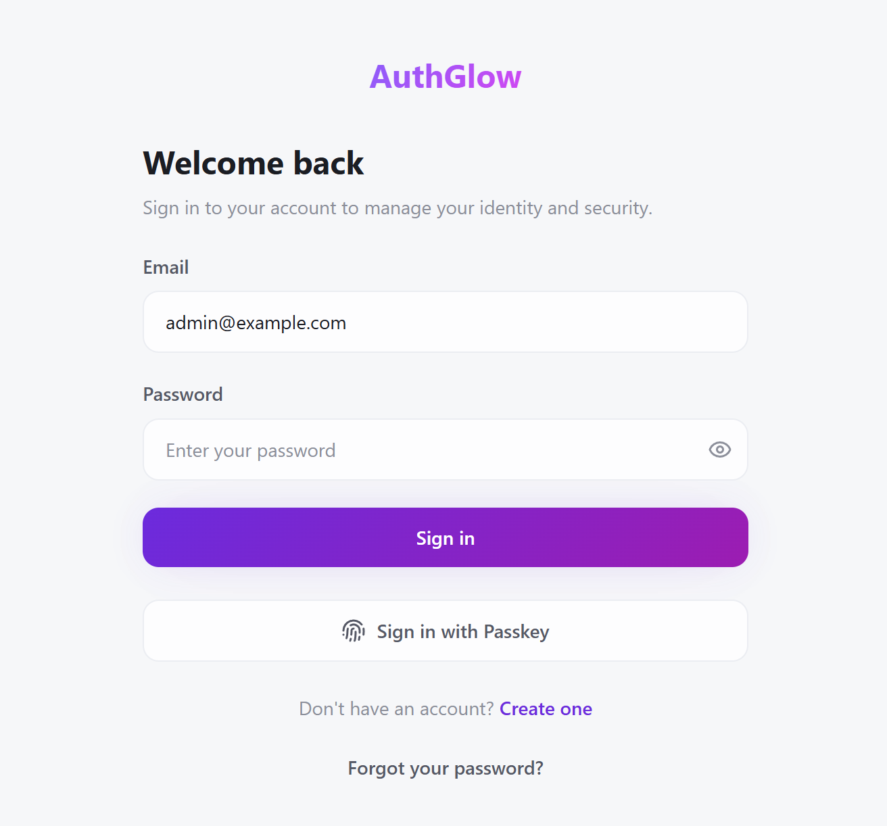
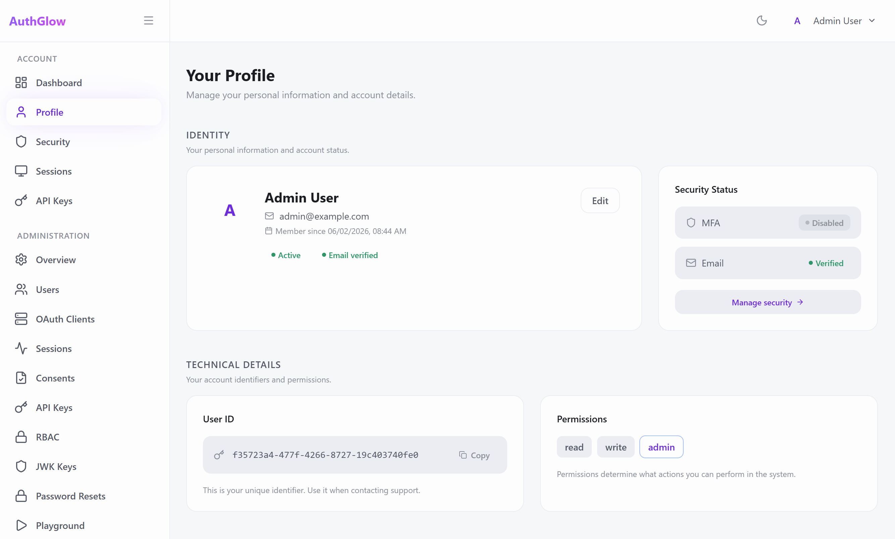

<p align="center">
  <picture>
    <source media="(prefers-color-scheme: dark)" srcset="backend/authglow/static/images/authglow_full_dark.png">
    <source media="(prefers-color-scheme: light)" srcset="backend/authglow/static/images/authglow_full_light.png">
    
  </picture>
</p>

<p align="center">
  
  
  
  <a href="https://codespaces.new/davideconsonni/authglow">
    
  </a>
</p>

<br>

> **The serverless identity provider I always wanted but couldn't find — so I built it and open-sourced it.**

<br>

---

## What is AuthGlow?

AuthGlow is a **self-contained, serverless-ready identity provider** — OAuth 2.0 & OpenID Connect authorization server, user management, MFA, Passkeys, RBAC, and admin dashboard. No database required.

It stores everything as files (JSON by default), runs anywhere with zero external dependencies, and scales to cloud storage (S3, GCS, Azure Blob) by changing **one environment variable**. No code changes needed.

---

## ✨ Features

**Authentication & Protocols**

- **OAuth 2.0 & OpenID Connect** — Authorization Code + PKCE, Client Credentials, Refresh Token rotation with theft detection, Token Introspection (RFC 7662), Revocation (RFC 7009), RP-Initiated Logout
- **Passkeys (WebAuthn)** — Passwordless FIDO2 authentication. Works with Touch ID, Windows Hello, YubiKey
- **Multi-Factor Authentication** — TOTP (Google Authenticator, Authy) + backup codes + trusted device remember
- **API Keys** — Scoped keys for programmatic access. Bcrypt-hashed, never stored in plaintext

**Authorization & Access Control**

- **RBAC** — Roles, permissions, and user-role assignments with granular route protection
- **OAuth2 Client Management** — Create and manage clients with custom branding, scopes, and grant types
- **User Consent** — Configurable consent screen with custom CSS branding per client

**Operations & Visibility**

- **Admin Dashboard** — Users, OAuth2 clients, sessions, consents, API keys, roles, audit logs
- **Audit Logging** — Every auth event, admin action, and security event tracked with structured logging
- **OAuth Playground** — Built-in tool to test every flow (Authorization Code, PKCE, Client Credentials)

**Infrastructure**

- **Serverless Storage** — File-based (JSON) by default. Swap to S3, GCS, or Azure Blob with `STORAGE_BACKEND`
- **Docker-Ready** — Single `Dockerfile`, single volume for persistence, one command to run
- **Zero Infrastructure Lock-in** — No database, no message queue, no cache cluster. Just files.

> Full catalog: [FEATURES.md](FEATURES.md)

---

## 🖥️ Screenshots

<p align="center">
  
  
</p>

---

## 📦 Quick Start

### Prerequisites

- **Python** 3.10+
- **Node.js** 18+ (frontend)
- **Git**

### Backend

```bash
git clone https://github.com/davideconsonni/authglow.git
cd authglow/backend

python -m venv .venv
source .venv/bin/activate       # macOS / Linux
.venv\Scripts\activate          # Windows

pip install -r requirements.txt
cp .env.example .env
# Edit .env — set a strong SECRET_KEY (32+ characters)

python main.py
```

> Backend starts at **http://localhost:8000**. On first run, visit `/setup` to create your admin account.

### Frontend (optional)

AuthGlow ships with built-in templates. The React SPA is optional:

```bash
cd authglow/frontend
cp .env.example .env
npm install
npm run dev
```

> Frontend starts at **http://localhost:5173**.

### Docker

```bash
docker build -t authglow .
docker run -p 8000:8000 -v ./data:/app/data --env-file .env authglow
```

### Minimum `.env`

```bash
SECRET_KEY=your-strong-secret-key-at-least-32-chars
BASE_URL=http://localhost:8000
STORAGE_BACKEND=file
STORAGE_PATH=./data/users
CORS_ALLOWED_ORIGINS=http://localhost:5173
```

---

## 🏗️ Architecture

```
authglow/
├── backend/
│   ├── authglow/
│   │   ├── api/          FastAPI routers (HTTP layer)
│   │   ├── core/         Config, crypto, rate limiting, concurrency
│   │   ├── middleware/   Security headers, request size limits
│   │   ├── models/       Pydantic data models
│   │   └── services/     Business logic (JWT, OAuth2, MFA, Passkeys, RBAC)
│   ├── tests/            Unit + integration tests (pytest)
│   └── main.py           Entry point
│
└── frontend/
    ├── src/
    │   ├── components/   React components (ui, layout, oauth, playground)
    │   ├── pages/        Route pages (auth, admin, dashboard)
    │   ├── stores/       Zustand state management
    │   └── hooks/        Custom React hooks
    └── e2e/              Playwright E2E tests
```

**Stack**: Python 3.11 / FastAPI / Pydantic (backend) + TypeScript / React / Vite / Tailwind / Zustand / TanStack Query (frontend).

**Persistence**: Files on disk or cloud object storage. No database, no migrations, no ORM.

---

## 🚀 Deployment

| Platform | Guide |
|---|---|
| **Docker** | `docker build -t authglow . && docker run -p 8000:8000` |
| **AWS Lambda** | Deploy FastAPI via Mangum + S3 storage backend |
| **GCP Cloud Run** | Container deploy, GCS storage backend |
| **Azure Functions** | Container deploy, Azure Blob storage backend |
| **VPS / Bare Metal** | systemd service, `STORAGE_PATH=/data/authglow` |

Change storage backend at any time — your data stays the same, just a different `STORAGE_BACKEND` value.

---

## 📖 Documentation

- [FEATURES.md](FEATURES.md) — Complete feature catalog
- [DESIGN.md](DESIGN.md) — Design system and visual language
- [AGENTS.md](AGENTS.md) — Developer guide for AI coding agents
- [docs/CIE.md](docs/CIE.md) — Italian Electronic Identity Card integration guide
- [docs/GOOGLE.md](docs/GOOGLE.md) — Google OIDC integration guide
- [API Docs](http://localhost:8000/docs) — Auto-generated OpenAPI (Swagger UI at `/docs`)

---

## 🤖 Built with AI

**100% AI-generated.** Every line of code, every template, every piece of documentation was written by AI models — Claude, Gemini, DeepSeek — under human direction. No manual coding.

I decided what to build and how. The AI wrote the code.

---

## 🐛 Help Me Break It

I'm posting this publicly because I genuinely want to see how far this thing can go — and where it fails.

**If you find a security bug, an edge case, or a creative way to exploit something, open an issue or a PR.** Every bug found is a bug fixed. Criticizing is caring.

---

## ⚠️ Disclaimer

This software is provided **as-is**, without warranty of any kind. The author assumes no responsibility for any damages, losses, or consequences arising from its use. Use at your own risk.

---

## 📄 License

MIT — see [LICENSE](LICENSE).