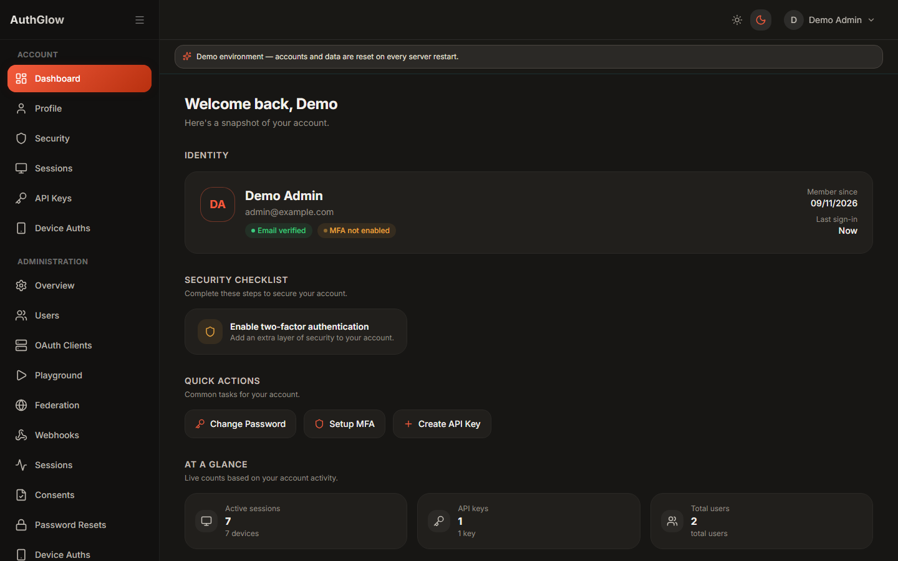
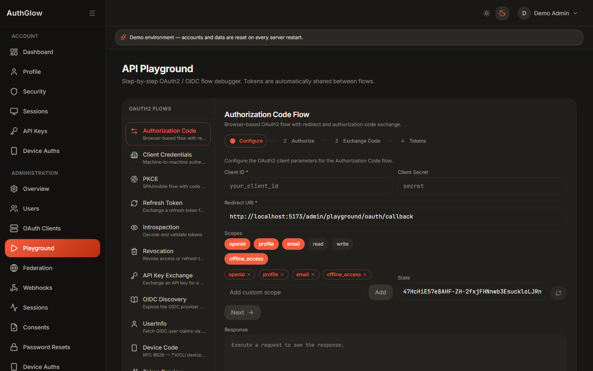
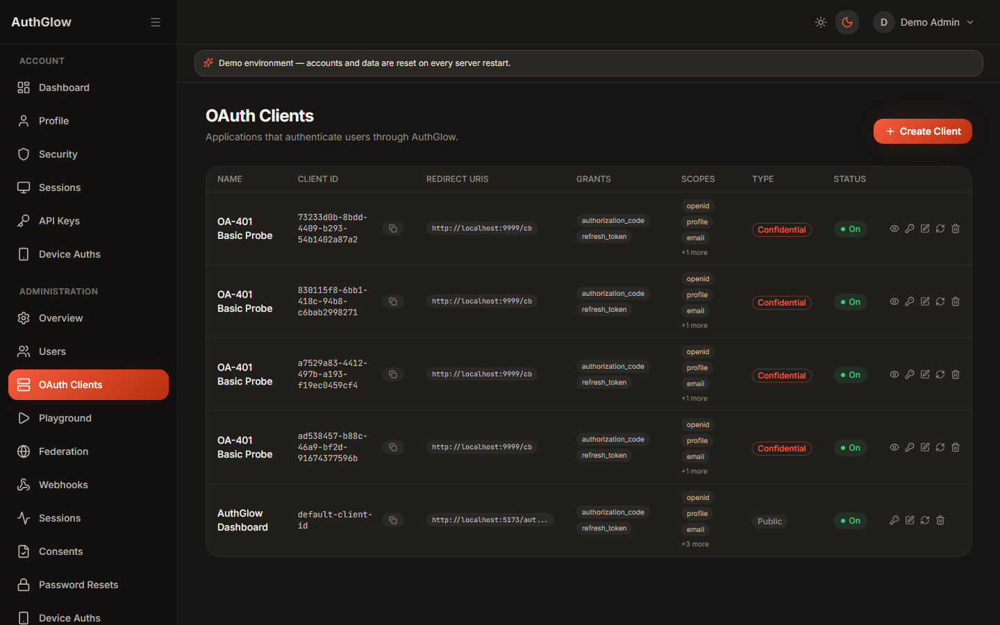
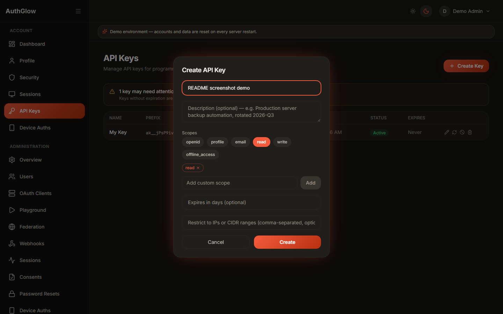
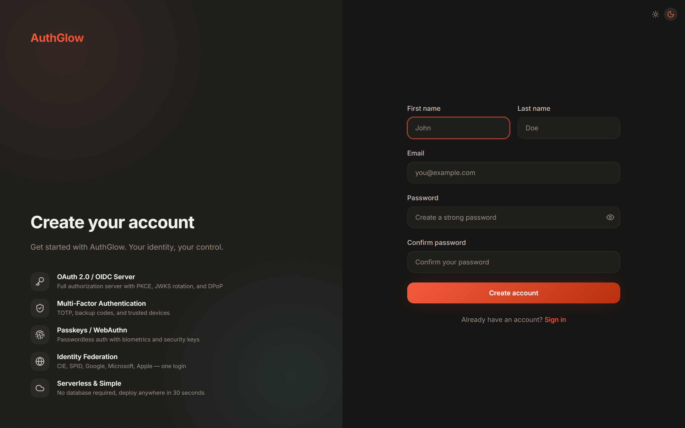

# AuthGlow

Self-hosted login, OAuth 2.0 / OpenID Connect, and user management for your apps. No database to manage — data lives in files.

<p align="center">
  
  
  <a href="https://github.com/davideconsonni/authglow/actions/workflows/test.yml"></a>
  <a href="https://codecov.io/gh/davideconsonni/authglow"></a>
</p>

---

## What is AuthGlow?

If you're building an app and need **sign-up, login, password reset, MFA, "Sign in with Google", and OAuth2 tokens** — run AuthGlow next to your app and let it handle identity, instead of building it yourself.

You get:

- A ready-made **login UI** (sign-in, registration, MFA, passkeys, profile, admin dashboard)
- A standard **OAuth2 / OpenID Connect server** your app talks to (Authorization Code + PKCE, refresh tokens, introspection, logout)
- An **admin console** to manage users, OAuth2 clients, sessions, API keys, and roles

A good fit for side projects, small-team apps, internal tools, and homelab setups. If you need multi-region scale, complex enterprise provisioning (SCIM), or a managed SLA — an hosted provider will serve you better.

---

## Screenshots

<p align="center">
  
  
</p>
<p align="center">
  
  
</p>
<p align="center">
  
  
</p>

---

## Try it

A public demo instance is available — to keep it out of search indexes the
address is written out below instead of linked (copy it into your browser):

```text
https://authglow-demo [dot] onrender [dot] com
```

The demo runs in demo mode: log in with the demo admin account shown on the page and click around (admin dashboard, OAuth Playground, security settings). Data resets on restart.

---

## What you get

**Sign-in options for your users**

- Email + password, with password reset and email verification
- Passkeys (WebAuthn/FIDO2) for passwordless sign-in
- TOTP authenticator apps, backup codes, trusted devices
- Phone verification via one-time codes (development passthrough, or Infobip SMS/WhatsApp)
- "Sign in with …" via any OIDC provider (Google, Microsoft Entra ID, Keycloak, Auth0, Okta, ...)

**OAuth2 / OIDC for your apps**

- Authorization Code with PKCE, Client Credentials, Refresh Token rotation with reuse detection
- Token introspection, revocation, RP-initiated logout
- Pushed Authorization Requests (PAR) and Device Authorization Grant (for TVs, CLIs, IoT)
- DPoP sender-constrained tokens; `client_secret_basic/post/jwt`, `private_key_jwt`, and public clients
- Scoped API keys (bcrypt-hashed, never stored in plaintext)

**Admin and customization**

- Admin dashboard: users, OAuth2 clients, sessions, consents, API keys, roles, signing keys, audit log
- Role-based access control with per-route enforcement
- Per-client consent screen branding and token claim policies
- White-labeling via environment variables (logo, colors, company name, legal links), light and dark mode
- Webhooks for auth and lifecycle events
- Built-in OAuth Playground to try each flow against your own instance

**Operations**

- No database: users, sessions, tokens, and keys are stored as files (see [Where is data kept?](#where-is-data-kept) below)
- Rate limiting, CSRF protection, security headers, HTTPS enforcement, structured audit log
- Single-container image (API + UI on one port) or backend-only image

Full endpoint catalog: [FEATURES.md](docs/reference/features.md)

---

## Quick start

### Option A — Docker (easiest, one container)

```bash
docker build -t authglow .

docker run -p 8080:8080 \
  -e PORT=8080 \
  -e SECRET_KEY="$(python -c 'import secrets; print(secrets.token_urlsafe(48))')" \
  -e ISSUER="http://localhost:8080" \
  -e BASE_URL="http://localhost:8080" \
  -e FRONTEND_BASE_URL="http://localhost:8080" \
  -e OAUTH2_FIRST_PARTY_REDIRECT_URI="http://localhost:8080/auth/callback" \
  -e PASSKEY_RP_ID="localhost" \
  -e PASSKEY_ORIGIN="http://localhost:8080" \
  -v authglow-data:/app/data \
  authglow
```

Open `http://localhost:8080/setup`, paste the setup token printed in the container log, and create your admin account. That's it — log in and explore.

<details>
<summary><strong>Just looking around? Start in demo mode (no setup step)</strong></summary>

Add `-e DEMO_MODE=true` to the `docker run` above. A demo admin account is seeded at boot and its credentials are shown right on the login page (click to copy) — no setup token, no admin creation. Data is ephemeral and resets on restart, and a banner reminds everyone it's a sandbox. Good for a first look or a public evaluation instance; don't use it for anything real.

</details>

### Option B — Local development (backend + frontend separately)

Prerequisites: Python 3.11+, Node.js, Git.

**Backend:**

```bash
git clone https://github.com/davideconsonni/authglow.git
cd authglow/backend

python -m venv .venv
source .venv/bin/activate        # Windows: .venv\Scripts\activate

pip install -r requirements.txt
cp .env.example .env
# Edit .env: set SECRET_KEY to a random value of at least 32 characters

python main.py
```

The API listens on `http://localhost:8000` and prints a setup token in the log — keep it for the next step. (Interactive API docs at `/docs` only when `ENABLE_DOCS=true`.)

**Frontend:**

```bash
cd authglow/frontend
cp .env.example .env
# Set VITE_API_URL=http://localhost:8000

npm install
npm run dev
```

Open `http://localhost:5173/setup`, submit the setup token, and create the administrator account. The default OAuth2 client in `.env.example` already works with the OAuth Playground, so no extra configuration is needed to try the flows.

---

## Using AuthGlow

Once the instance is running, the typical path is: **create a client → get a token → call with that token**. The easiest way to see every flow working against your own instance is the built-in **OAuth Playground** (admin UI), which walks through each step live.

### 1. Create an OAuth2 client

Via the admin UI (**OAuth clients** page), or programmatically with Dynamic Client Registration:

```bash
curl -X POST http://localhost:8080/oauth2/register \
  -H 'Content-Type: application/json' \
  -d '{
    "client_name": "My app",
    "redirect_uris": ["http://localhost:3000/callback"],
    "grant_types": ["authorization_code", "refresh_token"]
  }'
```

The response contains `client_id` and `client_secret` — the secret is shown **only here** and can't be retrieved later.

### 2a. Machine-to-machine: Client Credentials

For backend services with no user involved:

```bash
curl -X POST http://localhost:8080/oauth2/token \
  -u 'YOUR_CLIENT_ID:YOUR_CLIENT_SECRET' \
  -d 'grant_type=client_credentials' \
  -d 'scope=read'
```

Response: `{"access_token": "...", "token_type": "Bearer", "expires_in": 1800, ...}`.

### 2b. User login: Authorization Code + PKCE

For web/mobile apps: send the user to the authorize page with your `client_id`, `redirect_uri`, `code_challenge`, and `scope=openid profile email`. They sign in (password, passkey, or federated provider), approve consent, and your `redirect_uri` receives a `code` — exchange it at `POST /oauth2/token` with `grant_type=authorization_code`. Refresh tokens rotate on every use; reusing an old one invalidates the whole family.

### 3. Use the token

```bash
# Who is this token for?
curl http://localhost:8080/oauth2/userinfo \
  -H 'Authorization: Bearer YOUR_ACCESS_TOKEN'

# Is this token still valid? (for resource servers)
curl -X POST http://localhost:8080/oauth2/introspect \
  -u 'YOUR_CLIENT_ID:YOUR_CLIENT_SECRET' \
  -d 'token=YOUR_ACCESS_TOKEN'

# Log out / revoke
curl -X POST http://localhost:8080/oauth2/revoke \
  -u 'YOUR_CLIENT_ID:YOUR_CLIENT_SECRET' \
  -d 'token=YOUR_REFRESH_TOKEN'
```

Server-to-server without the OAuth dance: create a scoped **API key** in the admin UI (also shown once), then send it as `X-API-Key: ak_...` or `Authorization: Bearer ak_...`.

Your app can discover everything automatically at `/.well-known/openid-configuration`, with public signing keys at `/.well-known/jwks.json`.

Step-by-step guides per flow: [docs/flows/](docs/flows/README.md).

### Integrating with an AI coding assistant

This repo ships an **integration skill** that teaches an AI agent how to connect your app to AuthGlow correctly: `.agents/skills/authglow-integration/`. It picks the right flow for your app type, uses your framework's maintained OIDC library instead of hand-rolled crypto, and refuses to finish until a security checklist passes.

- **OpenCode**: the skill is already in place — prompt your session with:
  ```text
  Integrate this application with the AuthGlow instance at <issuer>.
  Inspect the project first, choose the correct OAuth2/OIDC flow,
  implement it with the framework's maintained library, and complete
  the security/compliance checklist before reporting success.
  ```
- **Claude Code**: copy `.agents/skills/authglow-integration/` to `.claude/skills/authglow-integration/` in your project, then use the same prompt.

It also handles auditing an existing integration, migrating from another provider, and troubleshooting login failures. Details: [.agents/skills/authglow-integration/README.md](.agents/skills/authglow-integration/README.md).

---

## Configuration

Everything is configured through environment variables — see `backend/.env.example`, which documents every setting with examples.

The only strictly required variable is:

```bash
# Generate one with: python -c "import secrets; print(secrets.token_urlsafe(48))"
SECRET_KEY=at-least-32-random-characters
```

Before exposing an instance publicly, also set the public URLs to your real origin (they default to localhost):

```bash
ISSUER=https://auth.example.com
BASE_URL=https://auth.example.com
FRONTEND_BASE_URL=https://auth.example.com
OAUTH2_FIRST_PARTY_REDIRECT_URI=https://auth.example.com/auth/callback
PASSKEY_RP_ID=auth.example.com
PASSKEY_ORIGIN=https://auth.example.com
```

The app refuses to start in production (`APP_ENV=production`) with placeholder secrets or localhost passkey settings, so misconfiguration fails loudly instead of silently.

Email delivery (`EMAIL_BACKEND`: console, SMTP, SendGrid, Mailgun, Resend) and phone OTP providers are documented with examples in `backend/.env.example`.

---

## Where is data kept?

In files — there is no database to install, migrate, or back up separately.

- By default everything (users, sessions, tokens, signing keys) lives under the data directory (`/app/data` in Docker, `./data` locally). **Back up that directory and you've backed up AuthGlow.**
- The storage code is organized as repositories — one repository per entity (users, sessions, tokens, …), all file-based.
- Instead of local disk, the file layer can read/write an object store: set `STORAGE_BACKEND` to `s3`, `gcs`, or `abfs` with `STORAGE_PATH` pointing at your bucket/container (examples in `backend/.env.example`). This is how you share state between multiple instances — each instance with its own local disk will generate its own signing keys and disagree about tokens.

---

## Architecture

```
authglow/
├── backend/
│   ├── authglow/
│   │   ├── api/            HTTP layer (FastAPI routers, one module per domain)
│   │   ├── core/           config, crypto, rate limiting, concurrency
│   │   ├── middleware/     security headers, HTTPS enforcement, body-size limits
│   │   ├── models/         request/response schemas (Pydantic)
│   │   ├── repositories/   storage layer (one file-backed repository per entity)
│   │   ├── services/       business logic: JWT, OAuth2, MFA, passkeys, RBAC, email
│   │   └── templates/      email templates
│   ├── tests/              pytest suite (unit + integration)
│   └── main.py             entry point
│
└── frontend/
    ├── src/
    │   ├── components/     feature components plus ui/ primitives, layout/, shared/
    │   ├── pages/          route components (auth, admin, dashboard, setup, …)
    │   ├── stores/         client state (Zustand)
    │   └── hooks/          custom hooks
    └── e2e/                Playwright end-to-end tests
```

Stack: Python 3.11+ / FastAPI / Pydantic v2 · TypeScript / React 19 / Vite / Tailwind CSS / Zustand / TanStack Query.

Details: [ARCHITECTURE.md](ARCHITECTURE.md) · [AGENTS.md](AGENTS.md) (contributor guide) · [DESIGN.md](DESIGN.md) (design system)

---

## Testing

```bash
cd backend
pytest -q --tb=line -n auto       # full suite, parallelized
ruff check authglow/ && mypy authglow/
```

```bash
cd frontend
npm test         # Vitest unit tests
npm run lint     # ESLint
npm run build    # type-check + production bundle
npm run test:e2e # Playwright end-to-end tests
```

---

## Documentation

- [Quick setup](docs/getting-started/quick-setup.md) — local and deployed setup walkthrough
- [OAuth2/OIDC flows](docs/flows/README.md) — per-flow guides
- [FEATURES.md](docs/reference/features.md) — complete feature and endpoint catalog
- [CIE integration](docs/guides/federation/cie.md) — Italian Electronic Identity Card
- [Google OIDC integration](docs/guides/federation/google.md) — Google sign-in
- [SECURITY.md](SECURITY.md) — how to report vulnerabilities

---

## Contributing

Bug reports and pull requests are welcome. Please read [AGENTS.md](AGENTS.md) for code style and test conventions first. For security vulnerabilities, follow [SECURITY.md](SECURITY.md) instead of opening a public issue.

---

## Project status

Active development on `main`. No tagged releases yet — pin a commit hash for deployments you care about.

---

## License

MIT — see [LICENSE](LICENSE).
