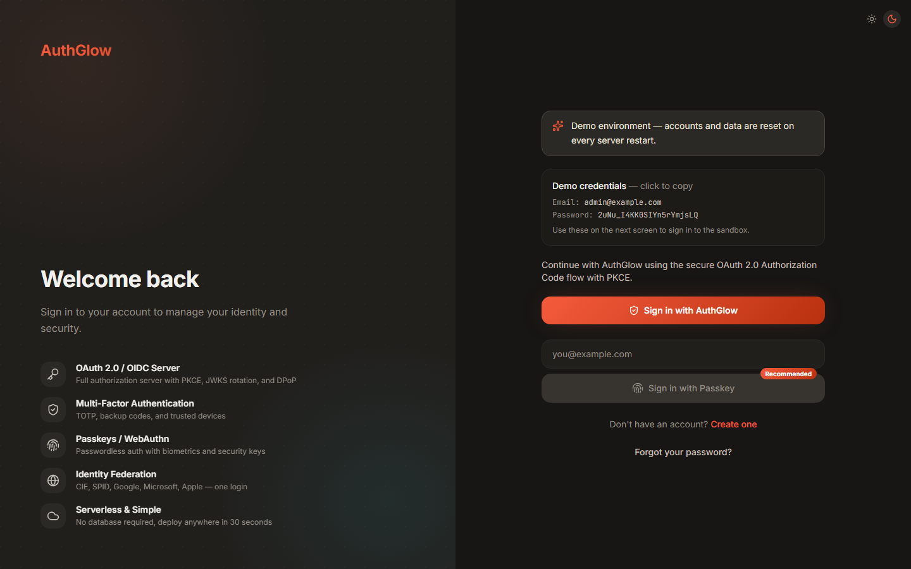
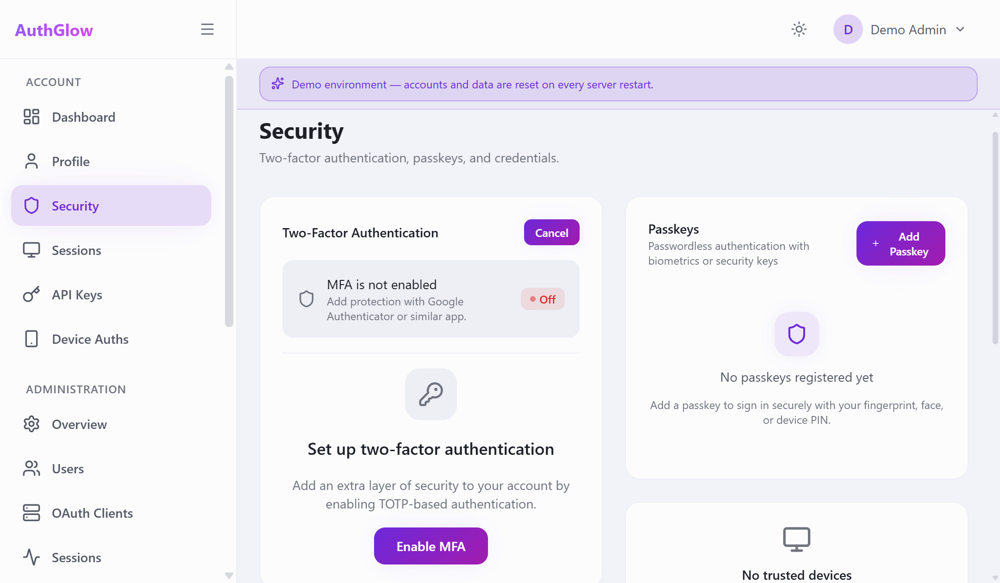
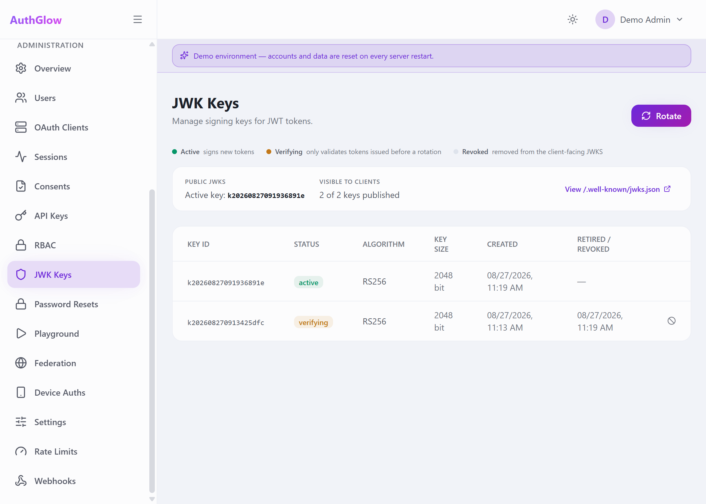
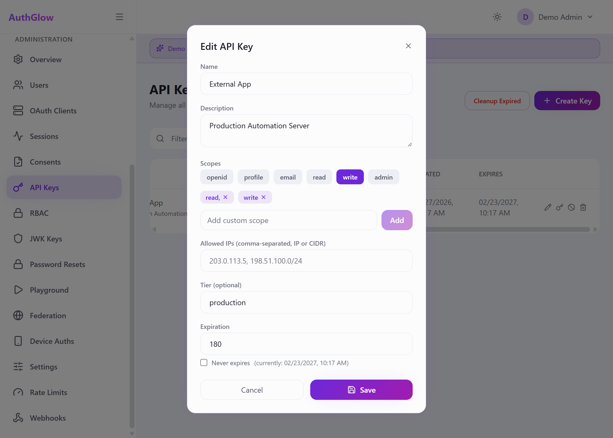

# AuthGlow

Self-hosted OAuth 2.0 / OpenID Connect authorization server with file-based storage. No database required.

<p align="center">
  
  
  <a href="https://github.com/davideconsonni/authglow/actions/workflows/test.yml"></a>
  <a href="https://codecov.io/gh/davideconsonni/authglow"></a>
</p>

---

## Overview

AuthGlow is a self-hosted OAuth 2.0 / OpenID Connect authorization server, user directory, and admin console. Users, sessions, tokens, and OAuth2 clients are stored as files through an [fsspec](https://filesystem-spec.readthedocs.io/) abstraction, so the same deployment runs on local disk or against S3, GCS, or Azure Blob storage.

Set `STORAGE_BACKEND` to `file`, `s3`, `gcs`, or `abfs` to change the object store. No migrations and no code changes required.

> Note: `STORAGE_BACKEND` selects the fsspec object store used by the file backend. It is distinct from `REPOSITORY_BACKEND`, the entity-storage selector, for which only `file` is currently implemented.

---

## Features

**Authentication and protocols**

- OAuth 2.0 and OpenID Connect: Authorization Code with PKCE, Client Credentials, Refresh Token rotation with reuse detection, Token Introspection (RFC 7662), Token Revocation (RFC 7009), RP-Initiated Logout
- Pushed Authorization Requests (PAR, RFC 9126)
- Device Authorization Grant (RFC 8628) for input-constrained devices
- Passkeys (WebAuthn/FIDO2) for passwordless sign-in
- Multi-factor authentication: TOTP, backup codes, trusted devices
- Phone verification via one-time codes (pluggable provider: development passthrough, Infobip SMS/WhatsApp)
- DPoP (RFC 9449): sender-constrained access tokens
- Client authentication: `client_secret_basic`, `client_secret_post`, `client_secret_jwt` (HS256), `private_key_jwt` (RS256), `none` (public clients with PKCE)
- Scoped API keys (bcrypt-hashed, never stored in plaintext)

**Identity federation**

- OIDC Relying Party support: delegate login to any OIDC-compliant provider via configuration
- Built-in providers: CIE, SPID, Google, Microsoft Entra ID, Apple, Keycloak, Auth0, Okta, GitHub, Facebook
- Account auto-creation and linking by email or external subject, per-provider claim mapping, federated logout

**Authorization and administration**

- Role-based access control with per-route enforcement
- Per-client claim policies controlling custom claims in access and ID tokens
- OAuth2 client management: scopes, grant types, branding, secret rotation
- Configurable consent screen with per-client branding
- Admin dashboard: users, OAuth2 clients, sessions, consents, API keys, roles, JWK keys, audit log
- Webhooks for auth and lifecycle events
- Built-in OAuth Playground covering Authorization Code, PKCE, Client Credentials, Device Code, Introspection, and Revocation flows

**Security and operations**

- Self-rotating RSA signing keys, encrypted at rest
- Rate limiting, CSRF protection, configurable CORS, OWASP security headers, HTTPS enforcement
- Structured audit log for authentication events and administrative actions
- White-labeling via environment variables (logo, colors, company name, legal links), with light and dark mode
- Optional demo mode (`DEMO_MODE=true`) with a seeded demo account and warning banner for public evaluation

**Infrastructure**

- No database: file-based storage by default, swappable to S3, GCS, or Azure Blob via `STORAGE_BACKEND`
- Single-container image (API + prebuilt SPA) or backend-only image
- No message queue or external cache required (optional Redis for shared cache via `CACHE_BACKEND=redis`)

Full endpoint catalog: [FEATURES.md](docs/reference/features.md)

---

## Screenshots

<p align="center">
  
  
</p>
<p align="center">
  
  
</p>

---

## Demo

Public demo instance: authglow-demo[.]onrender[.]com

---

## Quick Start

Running the full application (login, MFA, passkeys, admin dashboard, OAuth Playground) requires the backend API and the frontend UI.

Prerequisites: Python 3.11+, Node.js 26, Git.

### Backend

```bash
git clone https://github.com/davideconsonni/authglow.git
cd authglow/backend

python -m venv .venv
source .venv/bin/activate        # Windows: .venv\Scripts\activate

pip install -r requirements.txt
cp .env.example .env
# Set SECRET_KEY in .env to a random value of at least 32 characters

python main.py
```

The API listens on `http://localhost:8000`. On startup it logs a `setup_token_generated` event; retain the token value for the initial admin setup below. Interactive API docs are available at `/docs` only when `ENABLE_DOCS=true`.

### Frontend

```bash
cd authglow/frontend
cp .env.example .env
# The shipped default targets port 8001 — set VITE_API_URL=http://localhost:8000
# for split local development against the backend above

npm install
npm run dev
```

Open `http://localhost:5173/setup`, submit the setup token from the backend log, and create the administrator account. A default OAuth2 client is provided via `OAUTH2_CLIENT_ID` / `OAUTH2_CLIENT_SECRET` in `.env.example`, so the OAuth Playground works without additional configuration.

<details>
<summary><strong>Single-container deployment (backend + UI in one image)</strong></summary>

The root `Dockerfile` builds the full application: FastAPI serves the API and the prebuilt React SPA on a single port. Suitable for Cloud Run, Fly.io, Railway, Render, ECS/Fargate, or any Docker host that injects `$PORT`.

```bash
cd authglow
docker build -t authglow .

docker run -p 8080:8080 \
  -e PORT=8080 \
  -e SECRET_KEY="$(python -c 'import secrets; print(secrets.token_urlsafe(48))')" \
  -e ISSUER="https://auth.example.com" \
  -e BASE_URL="https://auth.example.com" \
  -e FRONTEND_BASE_URL="https://auth.example.com" \
  -e OAUTH2_FIRST_PARTY_REDIRECT_URI="https://auth.example.com/auth/callback" \
  -e PASSKEY_RP_ID="auth.example.com" \
  -e PASSKEY_ORIGIN="https://auth.example.com" \
  -v authglow-data:/app/data \
  authglow
```

- Single port, single process. Uvicorn serves `/api/...`, `/oauth2/...`, `/.well-known/...` and the SPA (client-side routes fall back to `index.html`).
- All configuration is applied at runtime. The SPA uses relative, same-origin API paths when `VITE_API_URL` is unset, so one image runs unchanged across environments.
- Persistent state (users, sessions, JWT keyring) lives under `/app/data`. On platforms with ephemeral filesystems, mount a volume at `/app/data` or set `STORAGE_BACKEND=s3` / `gcs` / `abfs`.

</details>

<details>
<summary><strong>Backend-only deployment (API without UI)</strong></summary>

`backend/Dockerfile` packages the API alone. Use this when integrating AuthGlow as the identity provider for an existing application.

```bash
cd authglow/backend
cp .env.example .env          # set SECRET_KEY at minimum

docker build -t authglow-api .
docker run -p 8000:8000 -e PORT=8000 \
  --env-file .env -v ./data:/app/data \
  authglow-api
```

</details>

---

## Configuration

Minimal `.env` for local development:

```bash
SECRET_KEY=your-strong-secret-key-at-least-32-chars
BASE_URL=http://localhost:8000
STORAGE_BACKEND=file
STORAGE_PATH=./data/users
CORS_ALLOWED_ORIGINS=http://localhost:5173
```

Remaining settings (password policy, passkey relying party, token lifetimes, white-labeling) default to the values in `backend/.env.example`.

### URL variables

The backend constructs absolute URLs from these variables (OIDC discovery, email links, OAuth redirects, passkeys). In production, all values must reference the same public origin.

| Variable | Purpose | Default |
|---|---|---|
| `ISSUER` | OIDC discovery (`/.well-known/openid-configuration`), token `iss` claim | `http://localhost:8000` |
| `BASE_URL` | Documentation links, federation callback URL | `http://localhost:8000` |
| `FRONTEND_BASE_URL` | Password-reset emails, device-code verification page, post-federation redirects | `http://localhost:5173` |
| `OAUTH2_FIRST_PARTY_REDIRECT_URI` | First-party OAuth2 redirect | `http://localhost:5173/auth/callback` |
| `PASSKEY_RP_ID` | WebAuthn relying-party ID (bare hostname) | `localhost` |
| `PASSKEY_ORIGIN` | WebAuthn origin (must match the browser address bar) | `http://localhost:8000` |

Example for `https://auth.example.com`:

```bash
ISSUER=https://auth.example.com
BASE_URL=https://auth.example.com
FRONTEND_BASE_URL=https://auth.example.com
OAUTH2_FIRST_PARTY_REDIRECT_URI=https://auth.example.com/auth/callback
PASSKEY_RP_ID=auth.example.com
PASSKEY_ORIGIN=https://auth.example.com
```

> `backend/.env.example` sets `PASSKEY_ORIGIN=http://localhost:5173` for split local development (backend on `:8000`, frontend on `:5173`), overriding the `http://localhost:8000` application default shown above. In a single-container deployment, set it to the public origin as shown here.

### Email delivery

Set `EMAIL_BACKEND` to `console` or `file_storage` for local development, or to `smtp`, `sendgrid`, `mailgun`, or `resend` for production delivery. Provider credentials and examples are documented in `backend/.env.example`. Set `EMAIL_FROM_ADDRESS` to a verified sender address. SMTP uses STARTTLS when `SMTP_USE_TLS=true`. For Mailgun EU domains, set `MAILGUN_BASE_URL=https://api.eu.mailgun.net`.

---

## Architecture

```
authglow/
├── backend/
│   ├── authglow/
│   │   ├── api/            FastAPI routers (HTTP layer, one module per domain)
│   │   ├── core/           config, crypto, rate limiting, concurrency
│   │   ├── middleware/     security headers, HTTPS enforcement, body-size limits
│   │   ├── models/         Pydantic schemas
│   │   ├── repositories/   storage layer (fsspec-backed, one implementation per entity)
│   │   ├── services/       business logic: JWT, OAuth2, MFA, passkeys, RBAC, email
│   │   └── templates/      Jinja2 email templates
│   ├── tests/              unit and integration tests (pytest)
│   └── main.py             entry point
│
└── frontend/
    ├── src/
    │   ├── components/     feature components (auth, admin, oauth, playground, ...)
    │   │                   plus ui/ primitives, layout/, and shared/
    │   ├── pages/          route components (auth/, admin/, dashboard, profile,
    │   │                   security, sessions, setup, ...)
    │   ├── stores/         Zustand state
    │   └── hooks/          custom hooks
    └── e2e/                Playwright end-to-end tests
```

Stack: Python 3.11+ / FastAPI / Pydantic v2 (backend); TypeScript / React 19 / Vite / Tailwind CSS / Zustand / TanStack Query / React Router (frontend).

Persistence: files on disk or cloud object storage via fsspec. No database, migrations, or ORM.

See [ARCHITECTURE.md](ARCHITECTURE.md) for the module map, request lifecycle, and conventions.

---

## Deployment

### Required environment variables

These have no default. The application refuses to start when they are missing.

| Variable | Purpose | Minimum length |
|---|---|---|
| `SECRET_KEY` | Encrypts sessions, signed cookies, and the JWT keyring at rest | 32 characters |

Generate a value:

```bash
python -c "import secrets; print(secrets.token_urlsafe(48))"
```

Provide it via your platform's secret management (Docker `--env-file`, Render dashboard, cloud secrets manager).

### Production settings

These default to local-development values and must be overridden before production use.

| Variable | Default | Production value |
|---|---|---|
| `APP_ENV` | `development` | `production` |
| `BASE_URL` | `http://localhost:8000` | Public URL (e.g. `https://auth.example.com`) |
| `ISSUER` | `http://localhost:8000` | Same as `BASE_URL` |
| `CORS_ALLOWED_ORIGINS` | `http://localhost:3000,...` | Frontend origin(s) |
| `OAUTH2_CLIENT_ID` | `change-me-in-production` | Unique identifier |
| `OAUTH2_CLIENT_SECRET` | `change-me-in-production` | At least 32 random characters |
| `PASSKEY_RP_ID` | `localhost` | Production domain |
| `PASSKEY_ORIGIN` | `http://localhost:8000` | Public URL |

Copy `backend/.env.example` as a starting point and override each value above. Production boot validates placeholders, localhost passkey origins, and `DEBUG`/`ENABLE_DOCS` settings and refuses to start on violations.

### Multi-instance deployments

The JWT signing keyring lives at `KEYS_DIR` (default `data/keys/`) on the same fsspec layer as users, sessions, and tokens, and honors `STORAGE_BACKEND`.

| Scenario | Backend | Notes |
|---|---|---|
| Single instance, local disk | `file` (default) | Keep `KEYS_DIR` on the same volume as `STORAGE_PATH` |
| Multiple instances, shared filesystem | `file` | Mount the shared filesystem at both `STORAGE_PATH` and `KEYS_DIR` |
| Multiple instances, separate disks | `s3`, `gcs`, `abfs` | Use a backend reachable for reads and writes from every instance |
| Multiple instances, each with local `file` storage | Not supported | Each instance generates its own keyring; tokens will not verify across instances |

---

## Testing

```bash
cd backend
pytest -q --tb=line -n auto       # full suite, parallelized
ruff check authglow/ && mypy authglow/
```

```bash
cd frontend
npm test         # Vitest unit tests
npm run lint     # ESLint
npm run build    # type-check + production bundle
npm run test:e2e # Playwright end-to-end tests
```

---

## Documentation

- [FEATURES.md](docs/reference/features.md) — complete feature catalog
- [Flows](docs/flows/README.md) — per-flow OAuth2/OIDC guides
- [ARCHITECTURE.md](ARCHITECTURE.md) — directory map and request lifecycle
- [DESIGN.md](DESIGN.md) — design system
- [AGENTS.md](AGENTS.md) — contributor guide (code style, test policy)
- [Quick setup](docs/getting-started/quick-setup.md) — local and deployed setup
- [CIE integration](docs/guides/federation/cie.md) — Italian Electronic Identity Card
- [Google OIDC integration](docs/guides/federation/google.md) — Google sign-in
- [SECURITY.md](SECURITY.md) — vulnerability reporting

---

## Contributing

Bug reports and pull requests are welcome. Contributors should read [AGENTS.md](AGENTS.md) for code style and test conventions before submitting changes. For security vulnerabilities, follow the process in [SECURITY.md](SECURITY.md) instead of opening a public issue.

---

## Project Status

Active development on `main`. No tagged releases yet; pin a commit hash for stable deployments.

---

## License

MIT — see [LICENSE](LICENSE).
