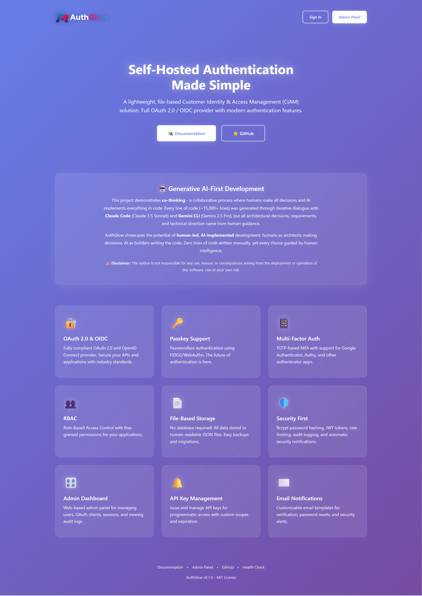
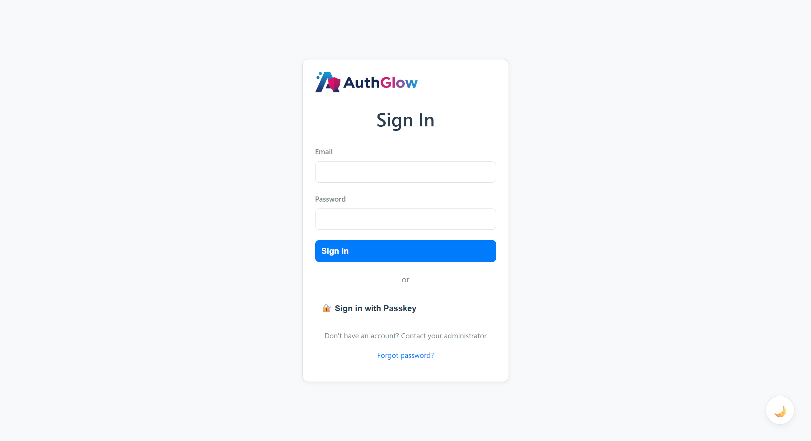
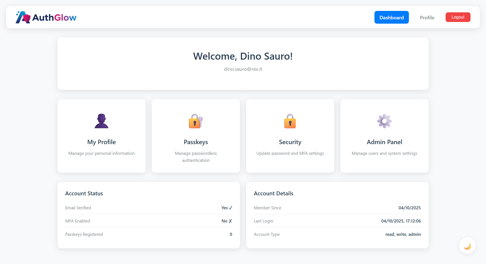
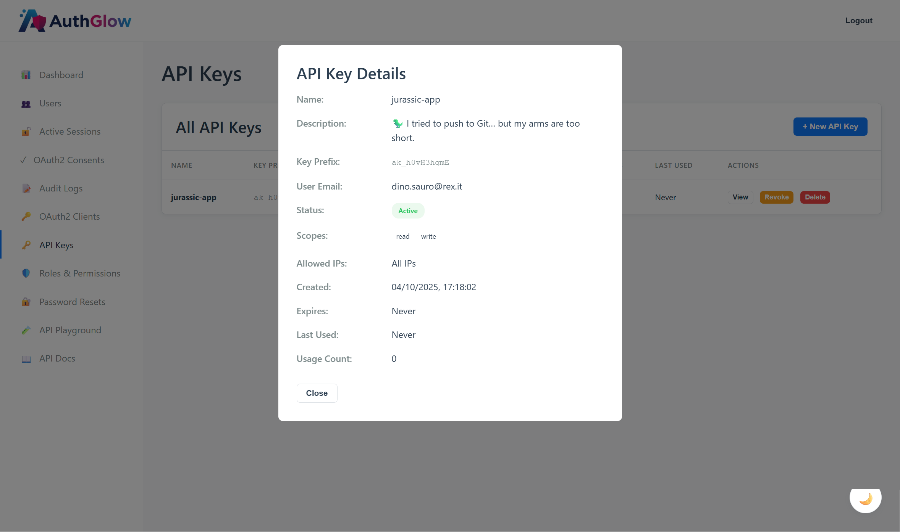
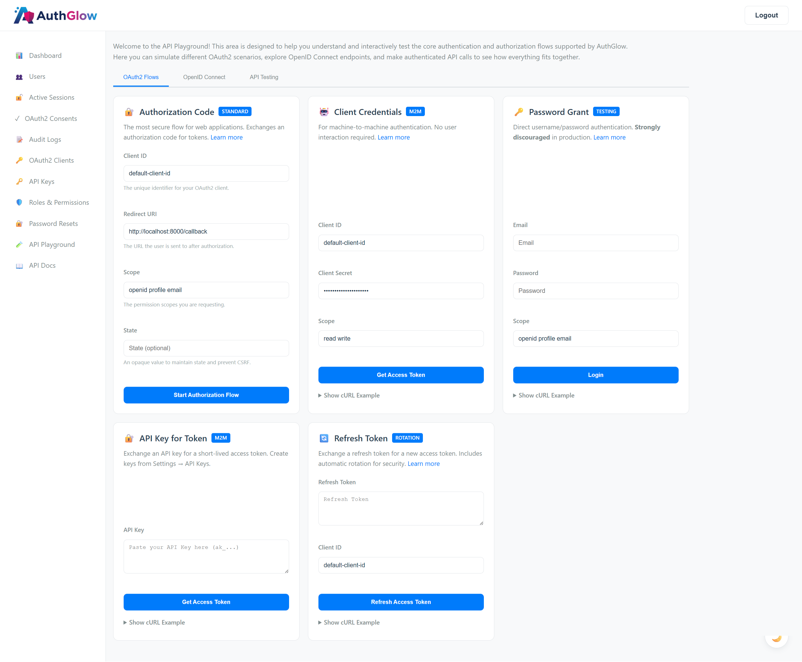

<!-- Aligning the logo to the center -->
<p align="center">
  <!-- GitHub's feature for light/dark mode image switching -->
  <picture>
    <source media="(prefers-color-scheme: dark)" srcset="authglow/static/images/authglow_full_dark.png">
    <source media="(prefers-color-scheme: light)" srcset="authglow/static/images/authglow_full_light.png">
    
  </picture>
</p>

<h1 align="center">AuthGlow</h1>

<p align="center">
  A lightweight, self-hostable, file-based Customer Identity & Access Management (CIAM) solution and OAuth 2.0 / OIDC provider, written in Python.
</p>

<p align="center">
  <!-- Placeholder badges -->
  
  
  
  
</p>

---

> **⚠️ GENERATIVE AI-FIRST PROJECT**
>
> **This is a Generative AI-First project - a complete software system designed and built entirely by AI agents without manual coding.**
>
> **This entire project, including all code and documentation, has been generated by AI (Claude Code with Claude 3.5 Sonnet and Gemini CLI with Gemini 2.5 Pro). Not a single line of code was written manually.**
>
> **This is a DEMONSTRATION project to showcase the current state-of-the-art in AI-assisted development. While functional, it is NOT intended for production use without thorough security review and testing.**

---

AuthGlow is designed for developers and small teams who need a robust identity solution without the complexity and overhead of managing a traditional database. It provides a full suite of features including user authentication, multi-factor authentication, passkeys (WebAuthn), and a complete OAuth 2.0 / OpenID Connect provider.

Its unique fsspec-based storage system makes it incredibly flexible and portable. Store data locally as JSON files for simplicity, or seamlessly scale to cloud storage (AWS S3, Google Cloud Storage, Azure Blob Storage) without changing a line of code. Human-readable format makes backups and migration effortless. Whether you're building a new application or need to centralize authentication for your existing services, AuthGlow offers a secure and flexible solution.

---

## 📸 Screenshots

### Landing Page
Modern gradient design showcasing AuthGlow's features and AI-first development approach.



---

### Login Interface
Clean authentication interface with support for email/password, MFA, and passwordless login via Passkeys.



---

### Admin Dashboard
Comprehensive admin panel with user statistics, recent activity monitoring, and system health metrics. Features light/dark theme support and responsive design.



---

### Machine-to-Machine API Authentication
OAuth 2.0 Client Credentials flow for secure API access. Supports API key management and JWT token generation for service-to-service authentication.



---

### API Playground
Interactive testing environment for OAuth 2.0 flows, OpenID Connect endpoints, and authenticated API calls. Experiment with Authorization Code, Client Credentials, and token validation in real-time.



---

## ✨ Key Features

*   **Standard Authentication**: Full user lifecycle management: registration, login, profile updates, and password reset.
*   🔐 **Multi-Factor Authentication (MFA)**: Enhance security with TOTP (Time-based One-Time Password) support.
*   🔑 **Passkey Support**: Embrace the future of authentication with passwordless logins using FIDO2/WebAuthn standards.
*   🌐 **OAuth 2.0 & OpenID Connect (OIDC) Provider**: Secure your APIs and applications with a fully compliant OIDC provider. Supports Authorization Code Flow with PKCE.
*   📜 **Role-Based Access Control (RBAC)**: Fine-grained permission management with roles and permissions.
*   🛡️ **API Key Management**: Issue and manage API keys for secure programmatic access to your services.
*   🎛️ **Admin Dashboard**: A simple web interface to manage users, clients, consents, and view audit logs.
*   ✍️ **Audit Trail**: Track important security events and account activities for monitoring and compliance.
*   🔔 **Security Notifications**: Automatically notify users about sensitive actions like password changes or new logins.
*   📄 **Flexible Storage with fsspec**: No database required! Uses fsspec for storage abstraction - store data locally as JSON files or seamlessly integrate with cloud storage (AWS S3, Google Cloud Storage, Azure Blob Storage). Human-readable format makes backups and migration a breeze.
*   🐳 **Docker Ready**: Deploy quickly and consistently with the provided Dockerfile.
*   ✉️ **Customizable Email Templates**: Easily modify email templates for verification, password resets, and security alerts.

## 🚀 Quick Start

Get your own AuthGlow instance running in minutes.

### Method 1: Docker (Recommended)

This is the easiest and recommended way to run AuthGlow, as it handles all dependencies for you.

1.  **Clone the repository:**
    ```bash
    git clone https://github.com/davideconsonni/authglow.git
    cd authglow
    ```

2.  **Create your configuration file:**
    Copy the example `.env` file. No changes are needed for a basic local setup.
    ```bash
    cp .env.example .env
    ```

3.  **Build the Docker image:**
    ```bash
    docker build -t authglow .
    ```

4.  **Run the container:**
    This command starts AuthGlow and maps the local `./data` directory to the container, ensuring your user data persists even if the container is removed.
    ```bash
    docker run -p 8000:8000 --name authglow-instance \
      -v ./data:/app/data \
      --env-file .env \
      authglow
    ```

5.  **Done!**
    AuthGlow is now running and accessible at `http://localhost:8000`.

### Method 2: Local Python Environment

If you prefer to run the application directly without Docker.

1.  **Prerequisites:**
    *   Python 3.10 or newer.
    *   `pip` and `venv`.

2.  **Clone the repository:**
    ```bash
    git clone https://github.com/davideconsonni/authglow.git
    cd authglow
    ```

3.  **Create and activate a virtual environment:**
    *   **Windows:**
        ```bash
        python -m venv .venv
        .venv\Scripts\activate
        ```
    *   **macOS / Linux:**
        ```bash
        python3 -m venv .venv
        source .venv/bin/activate
        ```

4.  **Install dependencies:**
    ```bash
    pip install -r requirements.txt
    ```

5.  **Configure your environment:**
    Copy the example `.env` file. It's highly recommended to review the settings inside `.env` and change the `SECRET_KEY` for any serious use.
    ```bash
    cp .env.example .env
    ```

6.  **Run the application:**
    ```bash
    python main.py
    ```

7.  **Done!**
    AuthGlow is now running and accessible at `http://localhost:8000`.

## 📚 Documentation

While this README provides a quick start, our comprehensive documentation in the `/docs` folder offers in-depth guides on:

*   Advanced configuration and all available environment variables.
*   Using AuthGlow as an OAuth 2.0 / OIDC provider for your applications.
*   Managing users, roles, and permissions.
*   Understanding the fsspec-based storage system and cloud backend configuration (S3, GCS, Azure Blob).

## 🤖 Generative AI-First Development

### What is a "Generative AI-First" Project?

This project represents a new paradigm in software development where **AI generates 100% of the code**, but under human direction and decision-making. Instead of developers writing code and using AI for autocomplete or suggestions, the entire system was created through **co-thinking** - an iterative dialogue where the human defines requirements, makes architectural decisions, and guides the AI, while the AI implements everything in code.

**Generative AI Tools Used:**
- **Claude Code** with **Claude 3.5 Sonnet** (Anthropic) - Primary code generation and architecture design
- **Gemini CLI** with **Gemini 2.5 Pro** (Google) - Code assistance and refinement

**What was AI-generated (100%):**
- ✅ Complete system architecture and design decisions
- ✅ All Python backend code (~15,000+ lines)
- ✅ All FastAPI routes and API endpoints
- ✅ All HTML templates (Jinja2)
- ✅ Complete OAuth 2.0 / OIDC implementation
- ✅ Security features (MFA, Passkeys, RBAC, Audit Logging)
- ✅ All documentation (5+ comprehensive guides in `/docs`)
- ✅ Configuration files (Docker, requirements.txt, .env.example)
- ✅ This README and landing page

**Human involvement (Co-Thinking Process):**
- **Decision-making**: All architectural and design decisions
- **Requirements definition**: Detailed specifications and use cases
- **Technical direction**: Choosing technologies, patterns, and approaches
- **Quality control**: Reviewing, testing, and validating AI-generated code
- **Iterative refinement**: Guiding the AI through feedback and corrections
- **Feature prioritization**: Deciding what to build and when
- **Zero manual coding**: Not a single line of code written by hand

**Purpose:**
This project demonstrates:
- **The current state-of-the-art** in AI code generation (2025)
- The **co-thinking model**: human intelligence for decisions + AI for implementation
- How AI can implement complex, production-grade systems under human guidance
- The ability of AI to follow industry standards (OAuth 2.0, OIDC, WebAuthn)
- AI's capability to write secure code (bcrypt, JWT, rate limiting, audit logs)
- The potential for **10x faster** development through human-AI collaboration
- The future of software engineering: humans as architects, AI as builders

### Why This Matters

AuthGlow showcases that modern AI can:
1. **Understand complex specifications** - OAuth 2.0, OIDC, WebAuthn standards
2. **Make architectural decisions** - fsspec storage abstraction, stateless design, security patterns
3. **Write production-quality code** - Error handling, validation, logging
4. **Follow best practices** - Security, performance, maintainability
5. **Create comprehensive documentation** - Setup guides, API references, security docs
6. **Iterate and refine** - Bug fixes, feature additions, optimizations

This is not just "AI-assisted" development - this is **human-led, AI-implemented** development through **co-thinking**.

### 🎵 Vibe Coding with LLMs

Want to work on this project with AI assistance? We provide **[llms-full.txt](llms-full.txt)** - a comprehensive context file that combines the complete README and all documentation in a single file.

**How to use it:**
- Download or copy the content of [`llms-full.txt`](llms-full.txt)
- Paste it into your AI coding assistant (Claude, ChatGPT, Gemini, etc.) at the start of your session
- The AI will have full context about the project's architecture, features, and implementation details

**What's included:**
- Complete README with project overview
- All 12 documentation guides from `/docs`
- ~144KB of comprehensive project information

Perfect for "vibe coding" sessions where you want to add features, fix bugs, or refactor code with full AI understanding of the entire codebase.

## ⚠️ Disclaimer

**The author is not responsible for any use, misuse, or consequences arising from the deployment or operation of this software. Use at your own risk.**

**DO NOT USE IN PRODUCTION WITHOUT:**
- Comprehensive security audit by qualified professionals
- Thorough penetration testing
- Code review by experienced developers
- Compliance verification for your specific requirements
- Load and stress testing
- Proper monitoring and incident response procedures

While AuthGlow implements industry-standard security practices (OAuth 2.0, bcrypt, JWT, etc.), any authentication system handling sensitive user data requires rigorous human review before production deployment.

## 📝 License

This project is licensed under the MIT License - see the [LICENSE](LICENSE) file for details.
