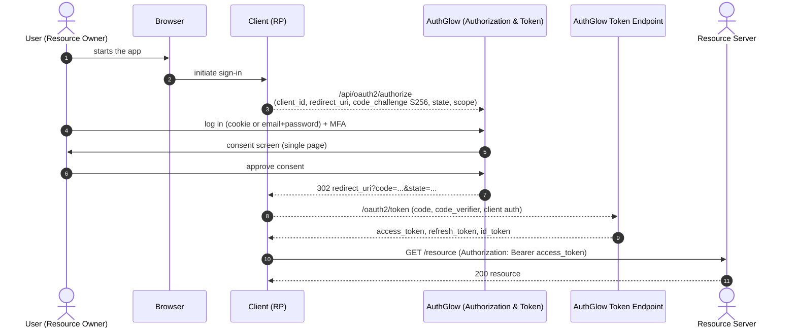

# Authorization Code + PKCE Flow

Browser-redirect authorization. This is the primary flow for web and
native apps, and the only one that produces an ID token (when the
`openid` scope is requested).

---

## Standard

- **Authorization Code Grant** — RFC 6749 §4.1
- **PKCE (Proof Key for Code Exchange)** — RFC 7636
- **OAuth 2.0 Security BCP** — RFC 9700
- OpenID Connect Core (for the `openid` scope) — OIDC Core 1.0

---

## Actors



---

## How we support it

Two main steps: the **authorization request** (browser → AuthGlow) and the
**token request** (client → server, backchannel).

### 1. Authorization Request

```
POST /api/oauth2/authorize                (form URL-encoded)
```

> **Come chiamare authorize, per RP diretti (OA-202).** Il
> `authorization_endpoint` in discovery (`{issuer}/oauth2/authorize`) è un
> entry point **front-channel via browser**: l'RP redirige il browser con
> `GET .../oauth2/authorize?response_type=code&client_id=...&...`, la SPA
> (`OAuthAuthorizePage`) guida login+MFA+consenso e poi invia
> `POST /api/oauth2/authorize` internamente. Non chiamare
> `POST /api/oauth2/authorize` server-to-server al posto del browser.
> `response_mode` supportato: solo `query` (default); `fragment` non è
> implementato e non è pubblicizzato (code flow non ne ha bisogno).

Parameters (form):

| Parameter              | Required | Notes |
|------------------------|----------|-------|
| `client_id`            | YES | Must exist and be active. |
| `redirect_uri`         | YES | **Exact** match against registered `redirect_uris`. |
| `scope`                | yes (default `read`) | Validated against the client scopes. |
| `state`                | no (RECOMMENDED) | Opaque nonce, `secrets.token_urlsafe(32)`; echoed verbatim when valid, omitted when absent. Present-but-weak → `302 error=invalid_request` without echo (OA-201). |
| `code_challenge`       | YES | PKCE mandatory. |
| `code_challenge_method`| `S256` | Only `S256`; `plain` rejected. |
| `nonce`                | no | Echoed in the ID token. |
| `prompt`               | no | `none`, `login`, `consent`, `select_account`. |
| `max_age`              | no | Force re-auth if `auth_time` is older. |
| `id_token_hint`        | no | Pre-identifies the user. |
| `claims`               | no | OIDC Core §5.5 — filters ID-token claims (JSON). |
| `acr_values`           | no | Requested ACR for the ID token. |

The endpoint:

1. Verifies client, PKCE, `redirect_uri`; validates `state` for echo-safety (OA-201, ex VAPT-044).
2. Authenticates the user (cookie-first, then `email`+`password`).
3. Runs MFA if required, then a single-page (login → MFA → consent).
4. Issues an **authorization code** (single-use, short-lived) and redirects:

```
HTTP 302  Location: {redirect_uri}?code={code}&state={state}
```

If `prompt=none` and not authenticated → `302 ?error=login_required`.

### Token request (backchannel)

```
POST /oauth2/token   (form URL-encoded)   grant_type=authorization_code
```

- `code`, `redirect_uri`, `code_verifier` are required.
- **Confidential** clients authenticate (Basic or `client_assertion`);
  **public** clients authenticate with `client_id` only (PKCE acts as
  the authenticator).
- PKCE `S256`: `SHA256(code_verifier)` MUST match the stored
  `code_challenge`.
- The code is **marked used** (CAS-protected) → not reusable.
- Issues: **access token** (JWT), **refresh token** (rotating), and an
  **ID token** when `openid` is among the scopes.

```json
{
  "access_token":  "...",
  "token_type":    "Bearer",
  "expires_in":    3600,
  "refresh_token": "...",
  "scope":         "openid profile",
  "id_token":      "..."
}
```

---

## Conformance

| Aspect | Status |
|--------|--------|
| PKCE | **Stricter than the standard**. MANDATORY for all clients (not just public), `S256` only. RFC 7636 + Security BCP require PKCE for **public** clients; here it is required **also for confidential** ones. |
| Redirect URI | Exact match; dynamic registration. |
| State | **Conformant**: RECOMMENDED, echoed verbatim when valid (16–512 chars, safe charset), omitted when absent; weak values → `invalid_request` redirect without echo. |
| Scope | **Conformant** (OA-203, RFC 6749 §5.2): scope beyond user grant → `400 invalid_scope`, never a silently reduced token. Client-level unknown scopes still filtered per `oauth2_reject_unknown_scopes` (known residual). |
| Consent flow | **Custom UX**: login, MFA and consent all on the **same page** (`/oauth2/authorize`, no inter-phase redirect). |
| Consent memory | "remember" consent → `consent/check` auto-creates the code without re-prompting. |
| Response type | `code` only. **Implicit flow rejected** (at the client model level). |
| Response mode | `query` only (OA-202). `fragment`/`form_post` neither emitted nor advertised. |
| Refresh token | Only with scope `offline_access` (OIDC Core §11, OA-206): without it the token response is access-token-only (`id_token` still included for `openid`), no error. Ask `offline_access` up front if you need long-lived sessions. |
| ACR | Values `0/1/2/3` (password, MFA, passkey) exposed in the ID token. |

---

## Endpoints

| Method | Path | Role |
|--------|------|------|
| POST | `/api/oauth2/authorize` | Auth request + login + MFA + consent |
| POST | `/oauth2/token` | Exchange code+verifier for tokens |
| GET | `/api/oauth2/authorize-info` | Public client info for the page |
| GET | `/api/oauth2/consent/check` | Check remembered consent |
| POST | `/oauth2/consent` | Consent decision |
| GET | `/oauth2/userinfo` | User claims (if requested) |

---

> **Custom vs standard**: while staying within the standard, this flow adds
> (1) mandatory PKCE everywhere, (2) validated `state` with redirect-error
> on weak values (never echoed), (3) a
> single-page UI, (4) refresh-token rotation, (5) explicit rejection of
> `implicit` and `password`. Everything else follows RFC 6749 / RFC 7636.