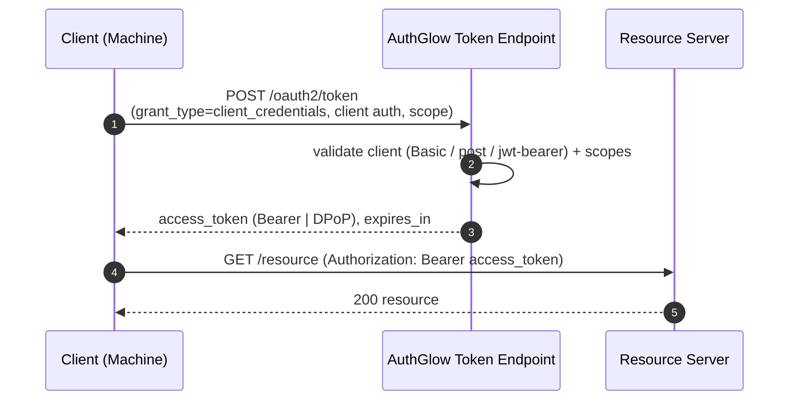

# Client Credentials Flow

Machine-to-machine authentication: the client authenticates as itself, no
end user involved.

---

## Standard

- **Client Credentials Grant** — RFC 6749 §4.4

---

## Actors



---

## How we support it

```
POST /oauth2/token   (form URL-encoded)   grant_type=client_credentials
```

Parameters:

| Parameter       | Required | Notes |
|-----------------|----------|-------|
| `grant_type`    | YES | `client_credentials` |
| `client_id`     | YES | Form or HTTP Basic. |
| `client_secret` | YES | Form or HTTP Basic. |
| `scope`         | no | Validated against the client `allowed_scopes`. |
| `client_assertion` / `client_assertion_type` | no | JWT-Bearer auth (RFC 7523), stronger alternative to the secret (T.2). |

Client authentication:

1. `client_secret_basic` (HTTP Basic) or `client_secret_post` (form).
2. Or **JWT-Bearer** `client_assertion` (HS256/RS256) — FAPI-aligned.

The scope is always validated: unknown scopes are filtered or rejected
(see `oauth2_reject_unknown_scopes`).

```json
{
  "access_token": "...",
  "token_type":   "Bearer",
  "expires_in":   3600,
  "scope":        "api"
}
```

The token subject is the `client_id` (no user). For `dpop_bound` clients a
DPoP proof is required and the token is issued with a `cnf` claim.

---

## Conformance

| Aspect | Status |
|--------|--------|
| RFC 6749 §4.4 | **Conformant**. |
| Scope | **Strictly validated** — scopes outside `allowed_scopes` are filtered or rejected (no custom scope issued). |
| Clients without `client_credentials` grant | Rejected via `grant_types`. |
| Lifetime | Per-client `access_token_lifetime` applied. |
| ROPC | Never allowed here. |

---

## Endpoints

| Method | Path | Role |
|--------|------|------|
| POST | `/oauth2/token` | Exchange client credentials for an access token |

---

> **Custom vs standard**: conformant to RFC 6749 §4.4. The only additions
> are strict scope validation and optional `client_assertion` (RFC 7523)
> as an authentication method — both additive, never an override.