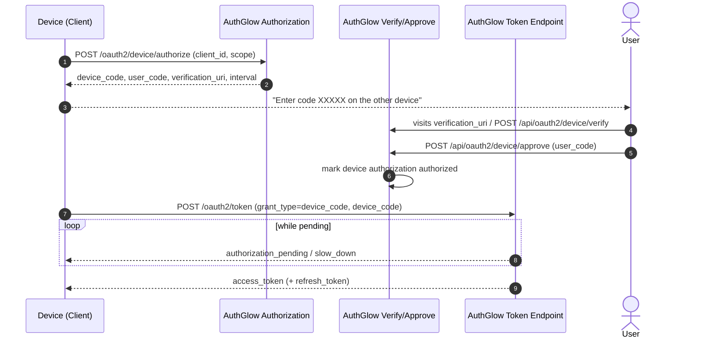

# Device Authorization Grant (RFC 8628)

For devices without a browser or with poor input (TV, CLI, IoT, smart
display). The user completes approval on a separate device.

---

## Standard

- **Device Authorization Grant** — RFC 8628

---

## Actors



---

## How we support it

### Device → server (init)

```
POST /oauth2/device/authorize   (form)   client_id + scope
```

Response (RFC 8628 §3.2):

```json
{
  "device_code":               "...",
  "user_code":                 "ABCD-1234",
  "verification_uri":          "https://.../oauth2/device/verify",
  "verification_uri_complete": "https://.../oauth2/device/verify?user_code=ABCD-1234",
  "expires_in":                1800,
  "interval":                  5
}
```

### User approves (on another device)

The user visits the `verification_uri` or enters the `user_code`. The
verify/approve endpoints **require an authenticated user session**
(cookie/first-party):

| Method | Path | Role |
|--------|------|------|
| POST | `/api/oauth2/device/verify` | Look up the `user_code`, return client + scopes |
| POST | `/api/oauth2/device/approve` | Approve the device (`user_code`) |
| POST | `/api/oauth2/device/deny` | Reject |
| GET | `/api/oauth2/device/authorizations` | List the user's device authorizations |
| POST | `/{user_code}/revoke` | Revoke the user's device authorization |

### Device polls

```
POST /oauth2/token   grant_type=urn:ietf:params:oauth:grant-type:device_code
     device_code=...
```

Pending responses (RFC 8628 §3.5):

| Error | Meaning |
|--------|---------|
| `authorization_pending` | User has not answered yet — keep polling (not an error) |
| `slow_down` | Polling too fast — increase the interval |
| `access_denied` | User rejected |
| `expired_token` | `device_code` expired |

Once the user has approved: issues an access token (and a refresh token).

---

## Conformance

| Aspect | Status |
|--------|--------|
| Device auth endpoint | RFC 8628 §3.1 **conformant**. |
| `user_code` | 8-char human-friendly format. |
| Polling | Minimum interval enforced server-side (`interval` + `slow_down`). |
| Approval | **Custom**: requires an authenticated user session on `/api/oauth2/device/*` (first-party AuthGlow API, not part of RFC 8628). |
| `verification_uri_complete` | Issued (UX optimization). |
| Scopes | Default `read`; validated against the client. |

---

## Endpoints

| Method | Path | Standard | Role |
|--------|------|----------|------|
| POST | `/oauth2/device/authorize` | RFC 8628 §3.1 | Start the flow |
| POST | `/oauth2/token` | RFC 8628 §3.4 | Poll → token |
| POST | `/api/oauth2/device/verify` | custom | Look up user_code (user auth) |
| POST | `/api/oauth2/device/approve` | custom | Approve |
| POST | `/api/oauth2/device/deny` | custom | Reject |
| GET | `/api/oauth2/device/authorizations` | custom | List my authorizations |
| POST | `/api/oauth2/device/authorizations/{user_code}/revoke` | custom | Revoke |

---

> **Custom vs standard**: device initiation and polling follow RFC 8628.
> The verify/approve APIs (`/api/oauth2/device/*`) are a **custom
> first-party extension** that requires an authenticated user session is
> not part of the standard — it serves the front-end approval flow.