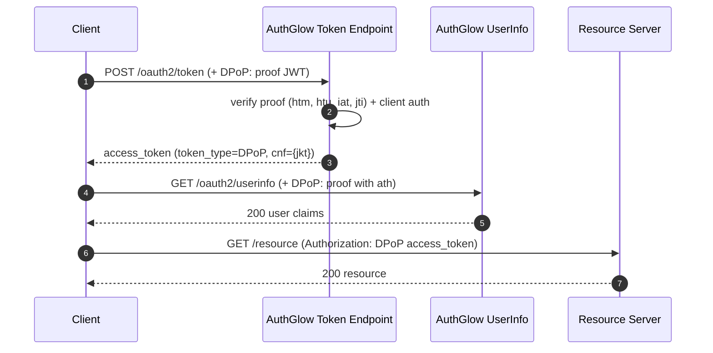

# DPoP — Sender-Constrained Tokens (RFC 9449)

Proof-of-possession binding: the access token is bound to the client's
public key, so the token is only usable by the holder of the key.

---

## Standard

- **Demonstrating Proof of Possession (DPoP)** — RFC 9449
- **Proof-of-Possession Key Semantics** — RFC 7800 (`cnf` claim)
- FAPI 2.0 §5.2.2

---

## Actors

---

## How we support it

DPoP is **opt-in per client** via the `dpop_bound` flag (default `False`).
When enabled:

1. The client presents a **DPoP proof JWT** in the `DPoP:` header on every
   request to the token endpoint and to UserInfo.
2. The access token is issued with `cnf={"jkt":"<thumbprint>"}` and
   `token_type=DPoP` (instead of `Bearer`).
3. UserInfo requires a proof with `ath` bound to the token.

### DPoP proof JWT required claims

| Claim | Meaning |
|-------|---------|
| `htm` | HTTP method (`POST`, `GET`, …) |
| `htu` | The token endpoint URL (target) |
| `iat` | Short-lived: max **120 s** |
| `jti` | Single-use, replay-protected via a server-side cache |
| `jwk` | In the proof header — the client's public key |

Algorithm: **`ES256` only** (to satisfy FAPI 2.0).

---

## Conformance

| Aspect | Status |
|--------|--------|
| RFC 9449 | **Conformant** (ES256). |
| `cnf` + `jkt` (RFC 7800) | Issued on bound access tokens. |
| `token_type` | `DPoP` instead of `Bearer`. |
| Opt-in | **Custom**: not mandatory — enabled per client (`dpop_bound`), not by default. |
| `iat` window | Max 120 s, replay cache. |

---

## Endpoints

| Method | Path | Standard | Note |
|--------|------|----------|------|
| POST | `/oauth2/token` | RFC 9449 | Requires a DPoP proof for bound clients |
| GET | `/oauth2/userinfo` | RFC 9449 | Requires a proof with fresh `ath` |

---

> **Custom vs standard**: fully conformant with RFC 9449, but **opt-in** per
> client (not mandatory by default) — which differs from FAPI 2.0's mandatory
> deployment. Bound tokens always carry `cnf` + `token_type=DPoP`.