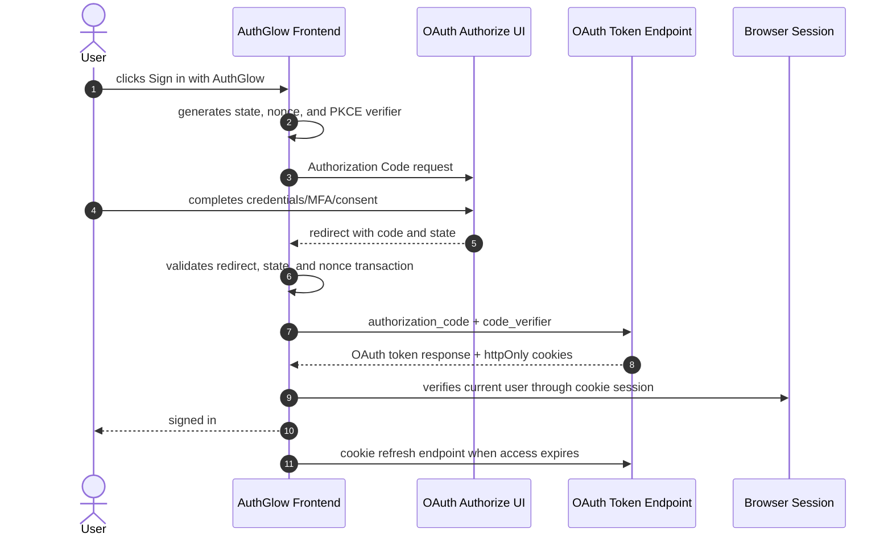

# First-Party Browser Login (Authorization Code + PKCE)

The AuthGlow dashboard is an OAuth2/OIDC public client. It uses the same
Authorization Code + PKCE flow available to other public applications and
receives only httpOnly browser session cookies after the callback.

## Configuration

Set the dashboard client values through:

```text
OAUTH2_CLIENT_ID
OAUTH2_FIRST_PARTY_REDIRECT_URI=https://authglow.example.com/auth/callback
```

On a remote (non-localhost) deployment also point `ISSUER` and
`OAUTH2_FIRST_PARTY_REDIRECT_URI` at the public origin — the authorize
endpoint matches the first-party `redirect_uri` against that exact string,
so a localhost default on a remote host breaks the login. See the
"URL variables for a real deployment" table in the root `README.md`.

The configured client is public, requires PKCE S256, and is restricted to the
exact first-party redirect URI. `OAUTH2_CLIENT_SECRET` is required only by
the production startup validator (`APP_ENV=production` refuses placeholder
values): it is never sent by the browser and is not part of this flow.

## Flow



## Endpoints

| Method | Path | Role |
|--------|------|------|
| GET/POST | `/oauth2/authorize` | Authorization UI and code issuance |
| POST | `/oauth2/token` | Authorization code exchange |
| POST | `/api/auth/refresh` | First-party cookie session rotation |
| POST | `/api/auth/logout` | First-party session logout |

`/api/token` is not registered. Password login is not exposed as an
application-specific authentication protocol.

## Security properties

- Passwords are entered only in the AuthGlow authorization UI.
- The dashboard uses Authorization Code + PKCE S256.
- `state` and `nonce` are generated with a CSPRNG and validated on callback.
- Access and refresh tokens are not persisted in browser storage.
- The browser receives httpOnly cookies for its local session.
- Third-party applications must register their own client and use discovery.
