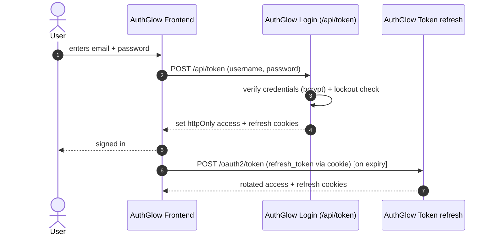

# First-Party Browser Login (`/api/token`)

Email+password login **reserved for the AuthGlow frontend itself**. It is
**NOT a standard OAuth2 grant** — it must not be used by third-party
clients.

---

## Standard

None. This is a **custom** proprietary flow that does not implement any
RFC 6749 grant type. It is the classic first-party "login".

---

## Actors



---

## How we support it

```
POST /api/token   (form URL-encoded)
```

Parameters: `username` (email), `password`, `grant_type=password` (accepted
here by the frontend only, not on `/oauth2/token`).

1. Verifies the credentials (bcrypt + transparent re-hash when the cost
   changes).
2. Loads the user; applies account lockout on repeated failures.
3. Issues an **access token** JWT and a **refresh token** (rotating).
4. Sets **httpOnly session cookies** (`auth_cookie_access_name`,
   `auth_cookie_refresh_name`) on the response.

The browser must not touch the tokens from JS: the session lives in
cookies.

---

## Conformance

Explicitly **non-standard**. It differs from `/oauth2/token` as follows:

| Aspect | `/oauth2/token` | `/api/token` |
|---------|-----------------|--------------|
| Grant | `authorization_code`, `client_credentials`, `refresh_token`, `device_code` | password (custom, non-OAuth) |
| Client auth | Required | None (first-party) |
| Session | Access token in body | Access + refresh token in **httpOnly cookies** |
| Usage | Third-party clients | AuthGlow frontend only |

**For this endpoint:**
- `grant_type=password` is NOT OAuth2 ROPC in the RFC 6749 §4.3 sense: it
  is a proprietary frontend login.
- On the standard token endpoint (`/oauth2/token`) it is reported as
  "unsupported".
- Use **only** from the first party; do not expose it to third parties.

---

## Endpoints

| Method | Path | Role |
|--------|------|------|
| POST | `/api/token` | Email+password login → set session cookies |

---

> **Custom vs standard**: entirely custom. It serves the frontend and is
> not an OAuth2 grant. Third-party clients must use `authorization_code`
> + PKCE (see [`authorization-code-pkce.md`](authorization-code-pkce.md)).