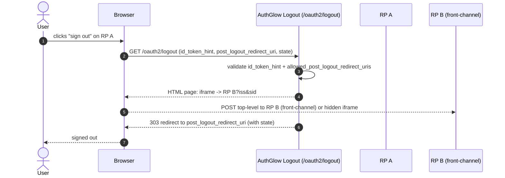

# OIDC RP-Initiated Logout

Lets a relying party end the user's session through AuthGlow, and propagate
the logout across the applications connected to it.

---

## Standard

- **OpenID Connect RP-Initiated Logout 1.0**
- **OpenID Connect Front-Channel Logout 1.0** (for clients that use it)

---

## Actors



---

## How we support it

```
GET /oauth2/logout? id_token_hint=...& post_logout_redirect_uri=...& state=...
```

Or `POST /oauth2/logout` (with Bearer auth, for audit).

Logic:

1. If a `post_logout_redirect_uri` is present, **`id_token_hint` is
   required** — it identifies the client (custom: the standard recommends
   it, here it is mandatory).
2. Validates `id_token_hint` (signature + `aud`).
3. Verifies `post_logout_redirect_uri` is in the client
   `allowed_post_logout_redirect_uris`; otherwise 400.
4. Redirects to `post_logout_redirect_uri` with the `state` echoed back.
5. **Front-Channel Logout** (OA-204): iframes go only to the session's
   clients — the hint client plus clients holding an ACTIVE refresh token
   for the user. Each iframe carries that client's OWN pairwise `sid`
   (`HMAC(secret, user | client | auth_time)`, 32 hex): stable within a
   login, fresh on the next login, different per client (no cross-client
   correlation). A client with a logout URI but no session for the user
   gets no iframe. Known limits: two logins within the same second share
   the `sid`; `auth_time=None` (legacy) never rotates; parallel logins
   may notify with the latest login's `sid` (fail-safe: missed
   notification, never a leak).

AuthGlow is **stateless**: no server-side session. The user/client delete
their own tokens; the server revokes the refresh token and blacklists the
access-token `jti`. The event is audit-logged.

---

## Conformance

| Aspect | Status |
|--------|--------|
| RP-Initiated Logout 1.0 | **Conformant**. |
| `post_logout_redirect_uri` | Exact match against `allowed_post_logout_redirect_uris`. |
| `id_token_hint` + redirect | **Custom, stricter**: required when asking for a redirect. |
| Front-Channel Logout | Supported (iframe `iss` + `sid`), session-targeted (OA-204). |
| `sid` | Derived pairwise `HMAC(user\|client\|auth_time)` (OA-204) — stable per login, rotated per login, never random-fresh. |
| Back-Channel Logout | `backchannel_logout_uri` is stored on the client but **not** executed (stateless). |
| `state` | Re-appended to the redirect URL. |

---

## Endpoints

| Method | Path | Role |
|--------|------|------|
| GET | `/oauth2/logout` | RP-Initiated Logout (query params) |
| POST | `/oauth2/logout` | Same, with Bearer auth |

---

> **Custom vs standard**: single difference — `id_token_hint` is required
> when a redirect is requested (the standard recommends it). Back-channel
> logout is not executed: the client is stateless. Revocation is
> server-side (OA-102): the presented access-token `jti` is blacklisted and
> the session's refresh tokens are revoked, scoped to the token audience
> (other clients untouched).