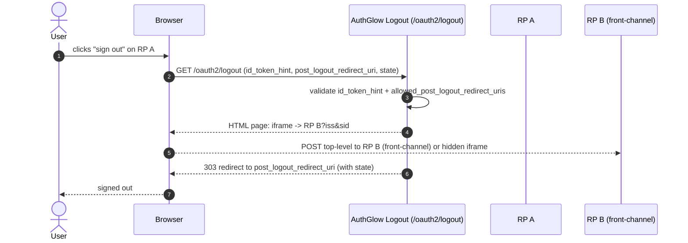

# OIDC RP-Initiated Logout

Lets a relying party end the user's session through AuthGlow, and propagate
the logout across the applications connected to it.

---

## Standard

- **OpenID Connect RP-Initiated Logout 1.0**
- **OpenID Connect Front-Channel Logout 1.0** (for clients that use it)

---

## Actors



---

## How we support it

```
GET /oauth2/logout? id_token_hint=...& post_logout_redirect_uri=...& state=...
```

Or `POST /oauth2/logout` (with Bearer auth, for audit).

Logic:

1. If a `post_logout_redirect_uri` is present, **`id_token_hint` is
   required** — it identifies the client (custom: the standard recommends
   it, here it is mandatory).
2. Validates `id_token_hint` (signature + `aud`).
3. Verifies `post_logout_redirect_uri` is in the client
   `allowed_post_logout_redirect_uris`; otherwise 400.
4. Redirects to `post_logout_redirect_uri` with the `state` echoed back.
5. **Front-Channel Logout**: if some clients have `frontchannel_logout_uri`,
   the response is an HTML page with one `<iframe>` per client
   (`?iss=...&sid=...`), then redirects after ~2s.

AuthGlow is **stateless**: no server-side session. The user/client delete
their own tokens; the server revokes the refresh token and blacklists the
access-token `jti`. The event is audit-logged.

---

## Conformance

| Aspect | Status |
|--------|--------|
| RP-Initiated Logout 1.0 | **Conformant**. |
| `post_logout_redirect_uri` | Exact match against `allowed_post_logout_redirect_uris`. |
| `id_token_hint` + redirect | **Custom, stricter**: required when asking for a redirect. |
| Front-Channel Logout | Supported (iframe `iss` + `sid`). |
| Back-Channel Logout | `backchannel_logout_uri` is stored on the client but **not** executed (stateless). |
| `state` | Re-appended to the redirect URL. |

---

## Endpoints

| Method | Path | Role |
|--------|------|------|
| GET | `/oauth2/logout` | RP-Initiated Logout (query params) |
| POST | `/oauth2/logout` | Same, with Bearer auth |

---

> **Custom vs standard**: single difference — `id_token_hint` is required
> when a redirect is requested (the standard recommends it). Back-channel
> logout is not executed: the client is stateless and revocation happens
> client-side.