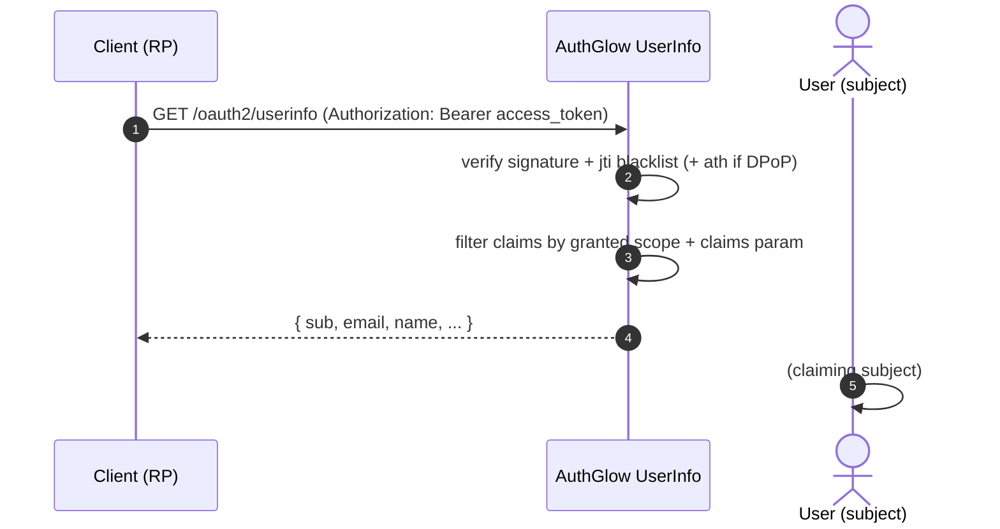

# OIDC UserInfo Endpoint

Returns the authenticated user's claims. Used by relying parties that
obtained an access token whose scope includes profile claims.

---

## Standard

- **UserInfo Endpoint** — OpenID Connect Core §5.1 (and §5.3/5.4)

---

## Actors



---

## How we support it

```
GET /oauth2/userinfo   (Authorization: Bearer <access_token>)
```

1. Verifies the **access token** (signature + `jti` blacklist; also
   `ath` for DPoP-bound tokens, RFC 9449).
2. Validates the granted **scopes**: the emitted claims depend on the
   scope (`openid`, `profile`, `email`, `phone`, `address`).
3. Applies any **`claims` request parameter** (OIDC Core §5.5): if the
   client sent `claims` at authorization time, the response is filtered
   to the requested claims only.

Example response (claims depend on scope):

```json
{
  "sub":               "user-id",
  "email":             "user@example.com",
  "email_verified":    true,
  "name":              "Mario Rossi",
  "preferred_username": "mariorossi"
}
```

---

## Conformance

| Aspect | Status |
|--------|--------|
| OIDC Core §5.1 | **Conformant**. |
| Scope-based emission | Claims limited to granted scopes. |
| `claims` request (§5.5) | Supported (filters both UserInfo and ID token). |
| `sub` + `azp` | Supported (authorized party). |
| DPoP | If DPoP-bound, requires a proof with fresh `ath`. |

---

## Endpoints

| Method | Path | Role |
|--------|------|------|
| GET | `/oauth2/userinfo` | Return user claims based on scope + claims param |

---

> **Custom vs standard**: conformant with OIDC Core §5.1/§5.5. The only
> addition is the integration of the `claims` request parameter to filter
> the response.