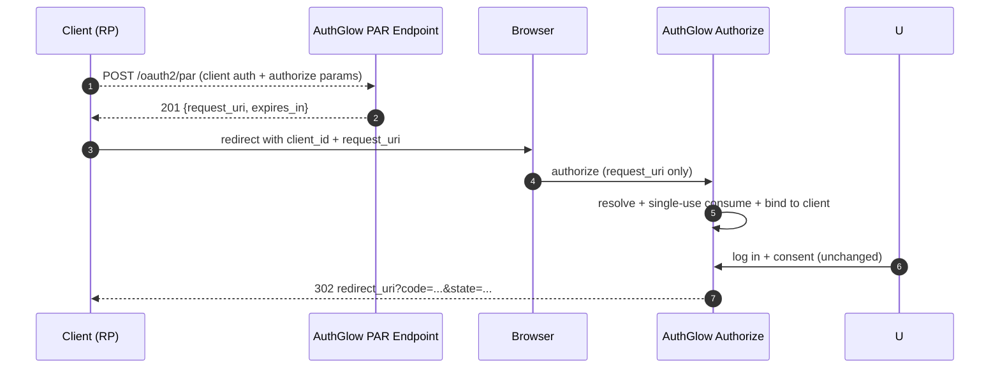

# Pushed Authorization Requests (PAR)

Clients push authorization parameters to the server over an
authenticated backchannel and receive a short-lived single-use
`request_uri`. The browser then carries only `client_id` +
`request_uri` instead of the full parameter set (OA-501).

---

## Standard

- **Pushed Authorization Request Endpoint** — RFC 9126
- Required building block of the FAPI 2.0 Security Profile

---

## Actors



---

## How we support it

### 1. Push (backchannel, authenticated)

```
POST /oauth2/par   (form URL-encoded)
```

Auth like the token endpoint (`client_secret_basic`,
`client_secret_post`, `client_secret_jwt`, `private_key_jwt`;
public clients with `client_id` only). Same validations as
authorize (redirect exact-match, PKCE, grant, scopes).

```
201 { "request_uri": "urn:ietf:params:oauth:request_uri:<opaque>",
      "expires_in": 90 }
```

TTL 90s (`par_request_uri_ttl_seconds`), single-use, bound to the
pushing client. Errors are direct RFC 6749 §5.2 bodies (no
redirect — the client has not been sent anywhere yet).

### 2. Authorize with `request_uri`

```
POST /api/oauth2/authorize   (form)   client_id + request_uri
```

The stored parameters replace the front-channel ones
(`scope`, `state`, PKCE, `nonce`, `prompt`, `max_age`, `claims`).
Unknown/expired/used/foreign `request_uri` → 302
`error=invalid_request`. Clients flagged `require_par` that call
without `request_uri` → 302 `error=invalid_request`.

### 3. curl example (standard confidential client)

Replace the `YOUR_*` placeholders with your values (`BASE` is the
AuthGlow origin, e.g. `https://auth.example.com`).

```bash
# 1. Push (backchannel, HTTP Basic like the token endpoint)
curl -s -X POST "$BASE/oauth2/par" \
  -u "YOUR_CLIENT_ID:YOUR_CLIENT_SECRET" \
  --data-urlencode "redirect_uri=https://app.example.com/cb" \
  --data-urlencode "scope=openid read offline_access" \
  --data-urlencode "state=YOUR_STATE" \
  --data-urlencode "code_challenge=YOUR_CODE_CHALLENGE" \
  --data-urlencode "code_challenge_method=S256"
# 201 {"request_uri":"urn:ietf:params:oauth:request_uri:<opaque>","expires_in":90}

# 2. Authorize with the request_uri (front channel, 90s to spend it)
curl -s -X POST "$BASE/api/oauth2/authorize" \
  --data-urlencode "client_id=YOUR_CLIENT_ID" \
  --data-urlencode "redirect_uri=https://app.example.com/cb" \
  --data-urlencode "request_uri=urn:ietf:params:oauth:request_uri:<opaque>" \
  --data-urlencode "email=YOUR_EMAIL" \
  --data-urlencode "password=YOUR_PASSWORD"
# 200 {"redirect_url":"https://app.example.com/cb?code=...&state=..."}
# (consent/MFA gates may apply first — same as the classic flow)
```

Error cases (all `302` back to `redirect_uri` with `error=invalid_request`):
stale/reused/foreign `request_uri`, `require_par` client without
`request_uri`, `request=` (JAR, unsupported), `response_mode=form_post`.

---

## Conformance

| Aspect | Status |
|--------|--------|
| `request_uri` format | `urn:ietf:params:oauth:request_uri:` + opaque id (RFC 9126 §2.2) |
| TTL | 90s default, configurable |
| Single-use | consume-on-first-presentation (CAS + lock) |
| Client binding | stored `client_id` must match the presenter |
| `require_par` | Opt-in per client (default off — tightening only) |
| Discovery | `pushed_authorization_request_endpoint` advertised |

---

## Endpoints

| Method | Path | Role |
|--------|------|------|
| POST | `/oauth2/par` | Push params, get `request_uri` (201) |

---

> **Custom vs standard**: `require_par` is our FAPI opt-in flag;
> everything else follows RFC 9126. The token endpoint never sees
> `request_uri` — it only ever redeems `code` as before.

---

## Non-supportato: JAR `request=` e `response_mode=form_post` (OA-502)

JWT-secured request objects (`request=`, OIDC Core §6) e `request_uri`
pre-registrati **non sono supportati**: `authorize` li rifiuta con 302
`error=invalid_request` (mai ignorati in silenzio). L'unica via con
integrità è PAR (direzione FAPI 2.0: JAR → PAR). Anche
`response_mode=form_post` è rifiutato — l'unico modo emesso è `query`.
