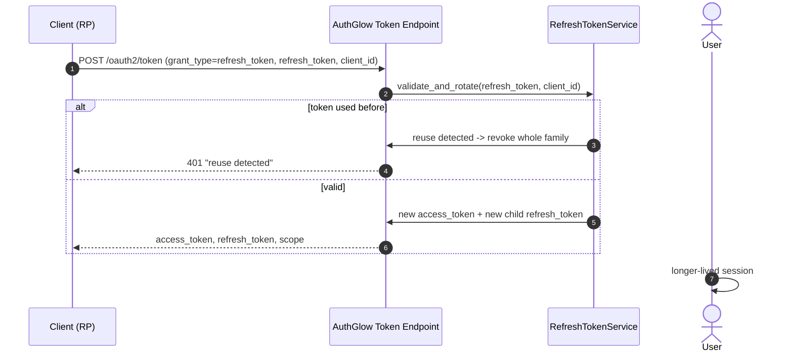

# Refresh Token Flow — Rotation & Reuse Detection

Extends the session without re-authenticating the user. AuthGlow applies
**rotation on every use** and **reuse detection**.

---

## Standard

- **Refreshing an Access Token** — RFC 6749 §6
- **OAuth 2.0 Security BCP** — RFC 9700 (recommends rotation + family revocation)

---

## Actors



---

## How we support it

```
POST /oauth2/token   (form URL-encoded)   grant_type=refresh_token
```

Parameters:

| Parameter      | Required | Notes |
|----------------|----------|-------|
| `grant_type`   | YES | `refresh_token` |
| `refresh_token`| YES | Form or `auth_cookie_refresh_name` cookie. |
| `client_id`    | YES | |

`RefreshTokenService.validate_and_rotate`:

1. Looks up the refresh token (by hash — the plaintext is never persisted).
2. Checks: not revoked, `client_id` matches, not expired.
3. If already `used` → **reuse detected**: revoke the whole **family**
   (all linked tokens via `parent_token_id`) and refuse.
4. Otherwise mark `used`, create a **child refresh token**
   (`parent_token_id` = the previous id) and remove the old one from the
   active index.
5. Issue a new **access token** JWT (fresh `jti`) and return it.

Protected by a `named_lock` on the lookup key plus optimistic-concurrency
(CAS) retries to avoid races on concurrent rotations.

```json
{
  "access_token":  "...",
  "token_type":    "Bearer",
  "expires_in":    3600,
  "refresh_token": "<NEW>",
  "scope":         "openid profile"
}
```

---

## Conformance

| Aspect | Status |
|--------|--------|
| RFC 6749 §6 | **Conformant** (includes rotation, which is recommended, not required). |
| Automatic rotation | Always on. Every refresh issues a new refresh token and invalidates the previous one. |
| Reuse detection | **Custom, stricter than the standard**: a reused refresh token revokes the entire family (RFC 9700 BCP recommends this). |
| Cookie fallback | The refresh token may arrive via httpOnly cookie (front-end first-party flow). |
| Replay | Fresh `jti` per refresh; reuse of the old token revokes the family. |
| Session management | `GET /api/tokens/refresh/list`, single revoke, or revoke-all ("log out from all devices"). |

---

## Endpoints

| Method | Path | Role |
|--------|------|------|
| POST | `/oauth2/token` | Renew access + refresh (rotation) |
| GET | `/api/tokens/refresh/list` | List the user's active refresh tokens |
| POST | `/api/tokens/refresh/revoke-all` | Revoke all of the user's refresh tokens |
| DELETE | `/api/tokens/refresh/{token_id}` | Revoke a single refresh token |
| POST | `/oauth2/revoke` | Revoke (RFC 7009) — breaks pending rotation |

---

> **Custom vs standard**: the flow follows RFC 6749 §6 and RFC 9700, but
> promotes rotation to mandatory and applies **whole-family revocation** on
> reuse — stricter than the default. In addition the client may renew by
> passing the refresh token in a httpOnly cookie (**custom**).