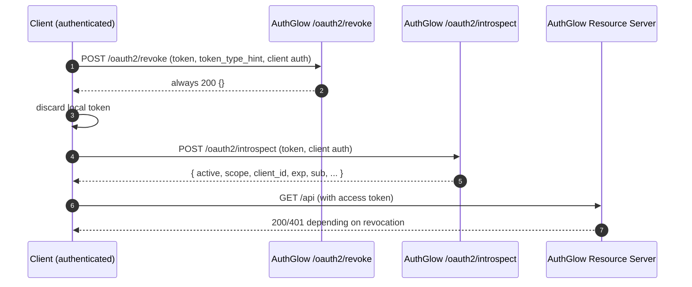

# Token Revocation & Introspection

Two endpoints that let clients and resource servers manage the token
lifecycle: **revoke** (RFC 7009) and **inspect** (RFC 7662).

---

## Standard

- **Token Revocation Endpoint** — RFC 7009
- **Token Introspection Endpoint** — RFC 7662
- Access-token revocation — RFC 7009 + JWT `jti` blacklist

---

## Actors



---

## Revocation — RFC 7009

```
POST /oauth2/revoke   (form)   token, token_type_hint, client_id, client_secret
```

Requires **client authentication** (HTTP Basic or form):

- **refresh_token** → revokes the refresh token in the repository.
- **access_token** → decodes the JWT and adds its `jti` to the persistent
  **blacklist** (shared across instances sharing the filesystem).

RFC 7009 mandates responding **always 200** (even if the token does not
exist or the credentials are wrong) to avoid leaking information. AuthGlow
honours this — even bad client auth returns `200 {}`.

## Introspection — RFC 7662

```
POST /oauth2/introspect   (form)   token, token_type_hint, client_id, client_secret
```

Requires **client authentication**. Returns:

```json
{
  "active":     true,
  "scope":      "openid profile",
  "client_id":  "...",
  "token_type": "access_token",
  "exp":        1690000000,
  "iat":        1689996400,
  "sub":        "user-id"
}
```

For **access tokens** (JWT) it also applies:

- **Audience binding**: if the token `aud` is NOT the introspecting
  client, returns `active=false` (RFC 7662 §2.2 — do not leak why).
- **Blacklist check**: a revoked `jti` → `active=false`.

---

## Conformance

| Aspect | Revocation | Introspection |
|--------|-----------|---------------|
| RFC | 7009 **conformant** | 7662 **conformant** |
| Client auth | Yes (Basic or form) | Yes (Basic or form) |
| Always 200 | Yes (even on bad creds) | — |
| Audience binding | — | custom: `active:false` if `aud` mismatch |
| Access token | persistent `jti` blacklist | blacklist respected |

---

## Endpoints

| Method | Path | Standard |
|--------|------|----------|
| POST | `/oauth2/revoke` | RFC 7009 |
| POST | `/oauth2/introspect` | RFC 7662 |

---

> **Custom vs standard**: both conformant. The only extension is the
> audience binding in introspection (only the target client can get active
> info on a token) — a stricter, safer behavior than the RFC requires.