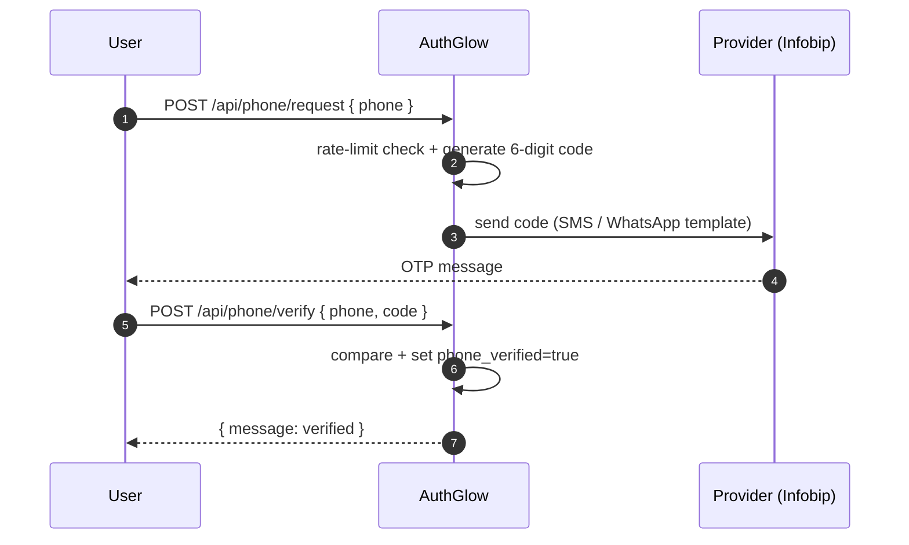

# Phone Verification

Prove ownership of a phone number with a one-time numeric code (OTP)
sent over SMS, WhatsApp, or a future channel. On success the user's
`phone_verified` flag is set, which feeds the OIDC
`phone_number_verified` claim (`phone` scope).

---

## Standard

- **OIDC Core §5.4** (`phone_number`, `phone_number_verified`)

---

## Actors



---

## How we support it

```
POST /api/phone/request   (auth, 5/hour)  -> send OTP
POST /api/phone/verify    (auth, 10/hour) -> prove OTP
```

1. `POST /api/phone/request` generates a 6-digit code (`secrets`
   CSPRNG), stores it hashed under an HMAC lookup, and sends it
   through the active provider. The number is stored on the user as
   **unverified**.
2. `POST /api/phone/verify` compares the presented code in constant
   time. On success `phone_verified=true` (+ timestamp) is set.
3. Changing the number (profile page or admin) resets
   `phone_verified=false` automatically — the new number must be
   proven again.

### OTP policy (env)

| Setting | Default | Meaning |
|---|---|---|
| `PHONE_CODE_LENGTH` | `6` | digits per code |
| `PHONE_CODE_EXPIRE_MINUTES` | `10` | code lifetime |
| `PHONE_MAX_ATTEMPTS` | `5` | wrong guesses before lockout |
| `PHONE_MAX_SENDS_PER_HOUR` | `5` | sends per number per hour |
| `PHONE_RESEND_COOLDOWN_SECONDS` | `60` | wait between sends |

### Message template

`PHONE_MESSAGE_TEMPLATE` holds the default text; `{code}` is replaced
with the numeric code. Templates without the placeholder get the code
appended so a misconfigured template can never send a codeless
message. The admin settings UI can override the template at runtime
(admin value wins over env, env wins over the code default).

---

## Providers

Single active backend (`PHONE_VERIFICATION_BACKEND`):

| Backend | Channel | Notes |
|---|---|---|
| `always_allow` | none | **Default.** Accepts every code, sends nothing. Dev/test only. |
| `infobip_sms` | sms | `POST {base}/sms/3/messages` (SMS API V3). **Recommended for OTP**: no delivery-window limit. |
| `infobip_whatsapp` | whatsapp | Template-first (`POST {base}/whatsapp/1/message/template`) for immediate delivery; free-form text fallback when no template is configured (delivered only inside the 24h customer-service window). |

Add a provider in 3 steps: (1) subclass `PhoneVerificationProvider`
(`send_code` / `validate_config` / `get_provider_name` /
`get_channel`), (2) add a `PHONE_VERIFICATION_BACKEND` case in
`services/phone/factory.py`, (3) add the settings it needs. Zero
changes to the OTP service or the API.

### Infobip setup

- Auth: `Authorization: App <INFOBIP_API_KEY>` against
  `https://<INFOBIP_BASE_URL>`.
- SMS sender: `INFOBIP_SMS_SENDER` (trial: `InfoSMS`).
- WhatsApp sender: `INFOBIP_WHATSAPP_SENDER` in international format
  (trial test sender: `447860099299`).
- WhatsApp template (the one provider-side exception): register an
  `AUTHENTICATION`-category template with a `COPY_CODE` button, then
  set `INFOBIP_WHATSAPP_TEMPLATE_NAME` +
  `INFOBIP_WHATSAPP_TEMPLATE_LANG` (default `en_GB`). The code is
  passed as the body placeholder. Without a template the provider
  falls back to free-form text (24h window only). The AuthGlow
  message template (`PHONE_MESSAGE_TEMPLATE`) is still used for SMS
  and every other channel.
- Trial accounts can only send to the verified signup number.
- HTTP 200 means **queued**; the per-message `status.groupName`
  (`PENDING` / `DELIVERED` vs `UNDELIVERABLE` / `EXPIRED` /
  `REJECTED`) decides success. Full delivery state needs Delivery
  Reports (webhook, not implemented).

References: [Send SMS message](https://www.infobip.com/docs/api/channels/sms/outbound-sms/send-message/send-sms-messages),
[Send WhatsApp text message](https://www.infobip.com/docs/api/channels/whatsapp/whatsapp-outbound-messages/whatsapp-text-and-media-messages/send-whatsapp-text-message),
[Send WhatsApp template message](https://www.infobip.com/docs/api/channels/whatsapp/whatsapp-outbound-messages/whatsapp-template-message/send-whatsapp-template-message),
[Authenticate users with a WhatsApp template message](https://www.infobip.com/docs/tutorials/authenticate-users-with-whatsapp-template-messages).

---

## Conformance

| Aspect | Status |
|--------|--------|
| OIDC `phone_number_verified` | **Real.** Reflects the verified flag (previously hardcoded `false`). |
| Code storage | HMAC lookup + plaintext body (mirrors email verification). |
| Brute force | Attempt cap + hourly send cap + resend cooldown. |
| Audit | `phone_verification_sent` / `phone_verified` / `phone_verification_failed`. |

---

## Endpoints

| Method | Path | Role |
|--------|------|------|
| POST | `/api/phone/request` | Generate + send OTP (authenticated) |
| POST | `/api/phone/verify` | Verify OTP, set `phone_verified` (authenticated) |

---

> **Custom vs standard**: the OTP transport is AuthGlow-specific; the
> emitted OIDC claims follow the standard.
